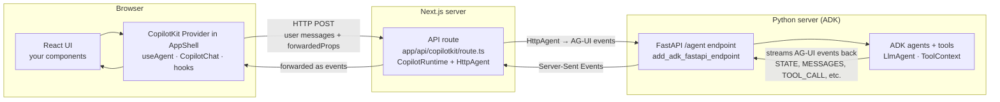
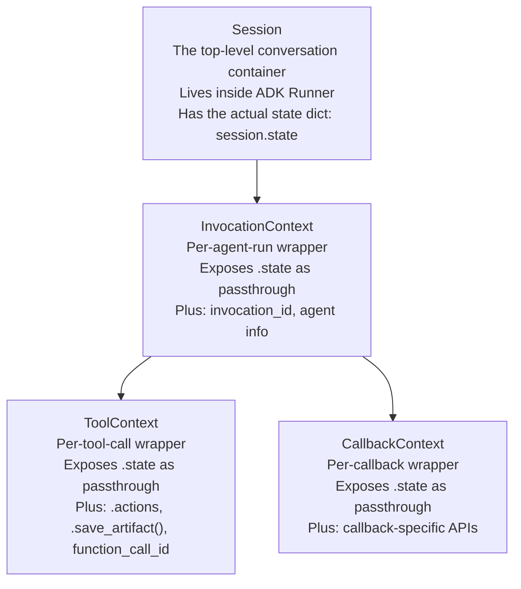

# ADK + CopilotKit — How It All Wires Together

A plain-English primer for how a Python backend (Google ADK) and a JavaScript
frontend (Next.js + CopilotKit) talk to each other over the AG-UI protocol.
Read this once to build the mental model.

This doc is about the **stack and protocol**, not any specific application.

---

## 0. Plain English — The Big Picture

**You have two programs that need to cooperate:**
- A Python program on the server that does the AI reasoning (Google ADK).
- A JavaScript program in the browser that shows the UI (Next.js + CopilotKit).

**They cannot call each other's functions directly** — they live in different processes,
different languages, different machines. They need a messaging protocol in between.

**That protocol is AG-UI.** It defines a small set of event types that flow over HTTP
and get translated into objects on both sides. AG-UI is what makes Python's
`tool_context.state["x"] = 1` show up milliseconds later as JavaScript's `agent.state.x`.

**Why there is a middle layer in Next.js:** The browser does not talk directly to the
Python server. It talks to a Next.js API route (typically `/api/copilotkit`), which
forwards to the Python server via `HttpAgent`. The middle layer exists because
CopilotKit's runtime can also host its own small LLM (via `AnthropicAdapter` or similar)
for peripheral features like suggestion generation and auto-titles, separate from the
main agent reasoning. It also gives you a natural place to do auth, logging, and
request shaping before requests reach the Python server.

---

## 1. ⚠️ The Upfront Rule — One Thing, Two Names

The biggest source of confusion: **the same object has different names on each side**,
because Python and JavaScript are two different languages.

| Concept | Python name (backend) | JavaScript name (frontend) |
|---|---|---|
| Shared state | `tool_context.state` | `agent.state` |
| Conversation history | ADK session event history | `agent.messages` |
| Is the agent running? | internal ADK status | `agent.isRunning` |
| Which conversation is this? | `session.id` | `agent.threadId` |
| Individual user/assistant turn | ADK `Event` | `Message` |

When this doc says "the shared state," that means **one object with two names** —
`tool_context.state` in Python and `agent.state` in JavaScript. AG-UI keeps the two
names pointed at the same data over the network.

---

## 2. Everything That Crosses the Wire

There are eight distinct categories of information flowing between backend and frontend.
Each one has its own AG-UI event type, its own Python-side API, and its own JavaScript-side API.

### 2.1 Shared state — the "notepad"

The agent's live working memory. Written by tools on the backend, read by React components
on the frontend. This is the foundation of "state-driven UI" patterns — the panel that
reacts to agent progress, the live status badge, the streaming results list.

| Direction | Backend | Frontend | AG-UI event |
|---|---|---|---|
| Agent writes | `tool_context.state["key"] = value` | — | `STATE_DELTA` or `STATE_SNAPSHOT` |
| Browser reads | — | `agent.state.key` | (arrived via above event) |
| Browser writes | — | `agent.setState({...})` | `STATE_DELTA` |

**Shape discipline:** Define the state shape as a Pydantic model on the backend and
mirror it as a TypeScript type on the frontend. Tools should serialize through the
Pydantic model before writing to state so the shape stays honest.

### 2.2 Conversation history — messages

Every user message and assistant response, plus tool calls and tool results, accumulate
as messages. This is what `CopilotChat` renders in the chat thread.

| Direction | Backend | Frontend | AG-UI event |
|---|---|---|---|
| Per-token streaming of AI text | — | appears in `agent.messages` | `TEXT_MESSAGE_START` → `TEXT_MESSAGE_CONTENT` (many) → `TEXT_MESSAGE_END` |
| Bulk sync (e.g. on reconnect) | — | replaces `agent.messages` | `MESSAGES_SNAPSHOT` |
| User types and sends | — | adds to `agent.messages` | sent as part of POST body |

**You almost never write messages directly on the backend.** ADK manages them. On the
frontend, you can inject a message programmatically with `agent.addMessage()` — useful
for card selection flows, onboarding prompts, or any UI interaction that should appear
as a user turn in the conversation.

### 2.3 Tool calls — when the AI invokes a function

When the AI decides to call a tool, AG-UI streams the call piece by piece so the UI
can show progress.

| AG-UI event | What it carries |
|---|---|
| `TOOL_CALL_START` | Tool name and an ID for this specific call |
| `TOOL_CALL_ARGS` (many) | Streaming JSON of the arguments as the LLM generates them |
| `TOOL_CALL_END` | Args are complete |
| `TOOL_MESSAGE` | The tool's return value (after the handler runs) |

The CopilotKit hooks `useFrontendTool` and `useRenderTool` subscribe to these events
and let you render UI that reflects each stage of the call.

### 2.4 Thinking / reasoning tokens

Reasoning-capable models (e.g. Claude with extended thinking) emit their reasoning
separately from their final answer. AG-UI carries these tokens on a **separate channel**
from regular message tokens.

| AG-UI event | What it carries |
|---|---|
| `THINKING_START` | Reasoning begins |
| `THINKING_TEXT_MESSAGE_CONTENT` | Reasoning tokens (streaming) |
| `THINKING_END` | Reasoning done |

**Why it matters:** these are filtered out of `agent.messages` by default so thinking
doesn't pollute the chat thread. If you want a "show the model's reasoning" toggle,
this is where the data comes from.

### 2.5 Custom events — the agent's "raise hand" channel

A fire-and-forget notification channel. The agent can emit named events mid-run and
the frontend can subscribe.

| Direction | Backend | Frontend | AG-UI event |
|---|---|---|---|
| Agent emits | `tool_context.emit_custom_event(name, payload)` | — | `CUSTOM_EVENT` |
| Browser receives | — | via `useInterrupt` hook or `agent.subscribe()` | (arrived via above) |

**The canonical use case is `on_interrupt`** — the agent signals it needs a human
decision before it can continue. The frontend renders a decision UI, the user resolves,
and a new agent run starts carrying the user's answer as `command.resume`.

### 2.6 Run lifecycle — starts and stops

Every agent invocation has a clear start and end. The frontend uses these to drive
spinners, disable inputs, and know when it's safe to send the next message.

| AG-UI event | What it means | Frontend effect |
|---|---|---|
| `RUN_STARTED` | Agent is beginning to process a user message | `agent.isRunning = true` |
| `RUN_FINISHED` | Agent is done, no errors | `agent.isRunning = false` |
| `RUN_ERROR` | Agent crashed — `error` payload attached | `agent.isRunning = false`, `onError` fires |

### 2.7 Reverse channel — browser → backend

Most of AG-UI is "server streams events to browser." But there are three things the
**browser sends to the server**:

| What | How it goes | When |
|---|---|---|
| User message | Added to the request body of the next POST | User types in chat and hits send |
| `forwardedProps` | Optional dict passed to `agent.runAgent({ forwardedProps })` | Programmatic triggering with extra context |
| `command.resume` | Wrapped inside `forwardedProps` as `{ command: { resume: value } }` | After an interrupt — this is how `resolve()` sends the user's answer back |

### 2.8 Capabilities handshake — the startup "hello"

Before any agent run happens, the frontend can query the backend to discover what it
supports.

| Where | What happens |
|---|---|
| `GET /agent/info` | Returns the agent's declared capabilities (tools, streaming support, etc.) |
| `useCapabilities()` | Frontend hook that reads this once at mount |

Useful for feature gates like "only show the voice input button if the agent supports
audio" or "only enable tools menu items the agent can actually handle."

---

## 3. The ADK Context Wrapper Family

On the Python side, you'll see multiple objects that all expose `.state`, and it
looks like there are several different state objects. There aren't. **It's always
the same dict, wrapped in different context objects depending on where you are.**

**What each wrapper gives you:**

| Wrapper | You see it when… | Adds on top of `.state` |
|---|---|---|
| `Session` | You're in framework-level code (rare for app code) | Nothing extra — this is the base |
| `InvocationContext` | You're in an agent callback or agent-level code | Invocation ID, agent metadata |
| `ToolContext` | You're inside a tool function | `.actions` (transfer, escalate, skip_summarization, emit_custom_event), `.save_artifact()`, `.function_call_id` |
| `CallbackContext` | You're in a before/after agent callback | Callback-specific APIs (e.g. intercepting LLM calls) |

Every `tool_context.state["..."] = ...` inside a tool function writes to the session's
single shared state dict — the same dict AG-UI streams as `agent.state` to the browser.
Agents do not each have their own state — all agents in one session share one state dict.

---

## 4. What Is NOT Shared

Knowing what crosses the wire is half the picture. Knowing what stays on one side
is the other half — it tells you where to put things.

### Backend-only (never sent to the browser)

| Thing | Why it stays on the backend |
|---|---|
| Agent instructions / system prompts | Shape the agent's behaviour. Privacy — the user should not see them. |
| Tool function bodies | The AI sees the tool's name and description; the actual code is server-only. |
| `tool_context.actions` | Not data — a control object the tool uses to instruct ADK ("transfer to another agent," "escalate," "emit a custom event"). |
| API keys and secrets | Live in the Python process's environment, never sent to the browser. |
| ADK memory service | Optional long-term cross-session recall. Persisted separately from session state. Only exists if you wire in a memory service; otherwise sessions die when the server restarts. |
| Session event history (full) | ADK keeps a rich event log; AG-UI only streams the user-visible subset as messages. |

### Frontend-only (never sent to the backend)

| Thing | Why it stays on the frontend |
|---|---|
| React `useState` for UI-only things | Panel open/closed, hover states, selected row highlighting |
| React refs (`useRef`) | DOM references, timers, drag state |
| CSS / styles | Obviously |
| Browser APIs (SpeechRecognition, SpeechSynthesis) | Voice input/output lives entirely in the browser |
| User preferences (theme, sidebar pinned state) | Unless you choose to sync them |

### Why this distinction matters

**If data needs to influence the agent's next reply → put it in the shared state.**
Example: a "currently selected item" identifier belongs in shared state so the agent
knows what the user is focused on when generating the next response.

**If data is only for UI presentation → keep it in React state.**
Example: whether a side panel is visually expanded belongs in React state — the agent
doesn't need to know.

---

## 5. AG-UI Events Cheat Sheet

The complete protocol at a glance. You'll see these in browser dev tools if you inspect
the API route's streaming response body.

| Category | Event types |
|---|---|
| Run lifecycle | `RUN_STARTED`, `RUN_FINISHED`, `RUN_ERROR` |
| Steps (multi-step workflows) | `STEP_STARTED`, `STEP_FINISHED` |
| Text messages | `TEXT_MESSAGE_START`, `TEXT_MESSAGE_CONTENT`, `TEXT_MESSAGE_END` |
| Bulk message sync | `MESSAGES_SNAPSHOT` |
| Tool calls | `TOOL_CALL_START`, `TOOL_CALL_ARGS`, `TOOL_CALL_END`, `TOOL_MESSAGE` |
| Thinking / reasoning | `THINKING_START`, `THINKING_TEXT_MESSAGE_CONTENT`, `THINKING_END` |
| State | `STATE_SNAPSHOT` (full replace), `STATE_DELTA` (JSON Patch) |
| Custom | `CUSTOM_EVENT` |
| Escape hatch | `RAW_EVENT` (pass-through for unsupported things) |

**STATE_SNAPSHOT vs STATE_DELTA:**
- `STATE_SNAPSHOT` sends the whole state dict. Used on first connection.
- `STATE_DELTA` sends a JSON Patch (RFC 6902) of just the changes. Used for updates.

**You rarely work with these events directly.** The CopilotKit hooks (`useAgent`,
`useFrontendTool`, etc.) abstract them into friendlier APIs. This table exists so
when you see one of these names in a log or the network tab, you know what bucket
it belongs in.

---

## 6. End-to-End Walkthrough — A Generic Flow

One user action, traced conceptually through every layer. Walk through this once and
the rest of the system makes sense. Each step names the layer responsible — map the
layer names to the specific file in your project.

**Scenario:** The user types a message in the chat and hits send. The agent calls a
backend tool that updates shared state; the frontend reacts and re-renders.

| # | What happens | Layer |
|---|---|---|
| 1 | User types a message in the chat input | Browser — `CopilotChat` |
| 2 | User hits send; message added to `agent.messages` | Browser — handled by `CopilotChat` |
| 3 | CopilotKit calls `agent.runAgent()` | Browser — automatic on send |
| 4 | POST request fires to the CopilotKit API route | Browser → Next.js |
| 5 | API route receives request | Next.js API route |
| 6 | `CopilotRuntime` routes the request to the configured agent binding | Next.js runtime |
| 7 | `HttpAgent` forwards the request to the Python server | Next.js runtime |
| 8 | FastAPI `/agent` endpoint receives the request | Python server — `add_adk_fastapi_endpoint` |
| 9 | `ADKAgent` wrapper kicks off an agent run on the ADK Runner | Python server |
| 10 | AG-UI emits `RUN_STARTED` back to the browser | AG-UI stream |
| 11 | Frontend sets `agent.isRunning = true` | Browser |
| 12 | Orchestrator agent reads its instructions and reasons about the user's request | Python — LLM call |
| 13 | Orchestrator delegates to a sub-agent (if multi-agent hierarchy) | Python — ADK sub-agent mechanism |
| 14 | Sub-agent decides to call a tool | Python — LLM call |
| 15 | AG-UI emits `TOOL_CALL_START`, then streams `TOOL_CALL_ARGS` chunks | AG-UI stream |
| 16 | Tool function executes on the backend | Python — tool function |
| 17 | Tool writes to `tool_context.state["..."]` | Python |
| 18 | AG-UI emits `STATE_DELTA` | AG-UI stream |
| 19 | `agent.state` updates in the browser | Browser |
| 20 | React hooks subscribed via `useAgent` trigger re-renders | Browser — React |
| 21 | UI components reading `agent.state` update to reflect the new data | Browser |
| 22 | Tool returns a value; AG-UI emits `TOOL_MESSAGE` | AG-UI stream |
| 23 | Sub-agent returns a brief summary to the orchestrator | Python |
| 24 | Orchestrator formats an assistant text response | Python — LLM call |
| 25 | AG-UI streams `TEXT_MESSAGE_START` → many `TEXT_MESSAGE_CONTENT` → `TEXT_MESSAGE_END` | AG-UI stream |
| 26 | `CopilotChat` renders the streaming response in the chat thread | Browser |
| 27 | Agent run completes, AG-UI emits `RUN_FINISHED` | AG-UI stream |
| 28 | `agent.isRunning = false` in the browser | Browser |

**That is the whole story.** Every subsequent user action follows the same shape —
a POST to the API route, a stream of AG-UI events back, React re-renders in response
to state or message changes.

---

## 7. Glossary

| Term | Plain English definition |
|---|---|
| **ADK** | Google's Agent Development Kit. The Python framework that runs AI agents on the server. |
| **AG-UI** | The wire protocol between ADK and the browser. Defines event types like `STATE_DELTA`, `TEXT_MESSAGE_CONTENT`, etc. |
| **CopilotKit** | The frontend library (React) that consumes AG-UI events and gives you components (`CopilotChat`) and hooks (`useAgent`, `useFrontendTool`). |
| **CopilotRuntime** | The Next.js-side runtime that receives requests from the browser and forwards them to your agents. |
| **HttpAgent** | A thin client that makes a CopilotRuntime agent-binding talk to a remote Python agent over HTTP. |
| **AnthropicAdapter** | CopilotKit's own small LLM used for peripheral features (suggestions, auto-titles). NOT used for the actual agent reasoning. |
| **`add_adk_fastapi_endpoint`** | The helper from `ag_ui_adk` that mounts the AG-UI streaming endpoint onto your FastAPI app. |
| **`ADKAgent`** | The `ag_ui_adk` wrapper around a raw ADK `LlmAgent` that makes it AG-UI-compatible. |
| **Session** | One conversation. Has an ID, a message history, and a shared state dict. Lives on the backend. |
| **Thread / threadId** | Same concept as Session, but the term used on the frontend side (`agent.threadId`). |
| **Invocation** | One specific agent run within a session. A session has many invocations over time (one per user message). |
| **Agent** | An LLM with instructions, tools, and optionally sub-agents. Multi-agent hierarchies are built by passing sub-agents to a root `LlmAgent`. |
| **Tool** | A Python function the agent can call. Has a name, description, and typed parameters. Runs on the backend. |
| **Callback** | A hook point in ADK for intercepting agent behaviour (e.g. before/after each LLM call). |
| **ToolContext** | The wrapper object ADK gives your tool function. Exposes `.state` (shared with browser), `.actions` (control the agent), and utilities. |
| **State** | The shared data object. Python writes `tool_context.state["x"] = 1`. JavaScript reads `agent.state.x`. Same object, two names. |
| **Messages** | The conversation history. An array of user/assistant/tool messages. Synced to `agent.messages` in the browser. |
| **`runAgent()`** | JavaScript function that tells the agent to process the current messages. Called automatically when the user hits send. |
| **`addMessage()`** | JavaScript function that injects a message into the conversation without user typing. Useful for programmatic UI interactions. |
| **`setState()`** | JavaScript function that updates shared state from the browser side. Flows back to the backend. |
| **`emit_custom_event()`** | Python function that sends a named signal to the frontend without going through messages or state. Used for interrupts. |
