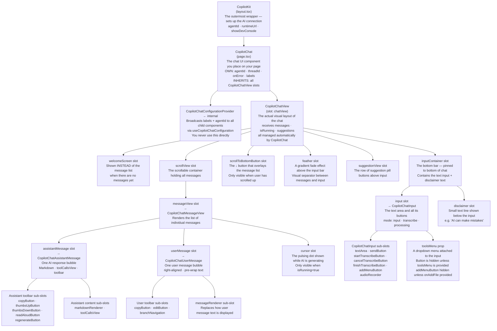
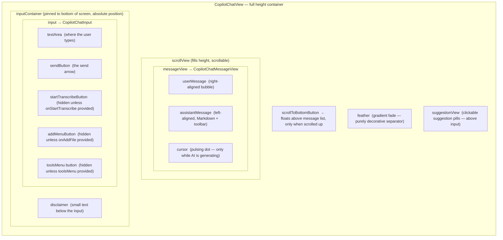
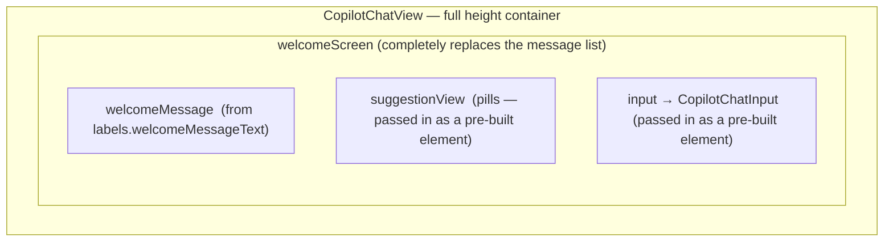
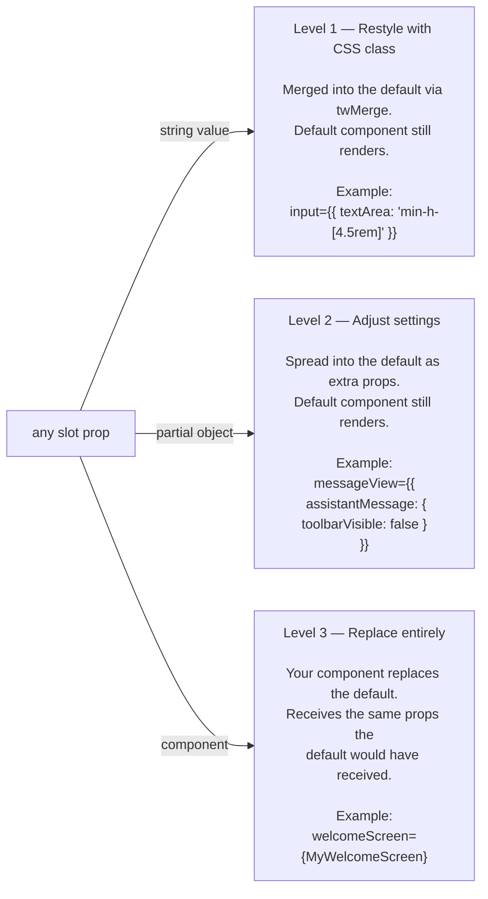

# CopilotChat v2 — Component Anatomy

Visual reference for how `CopilotChat`, `CopilotChatView`, and all slots compose together.

---

## 0. Plain English First — What CopilotChat Actually Is

Before any diagrams, here is the idea in everyday language.

**`CopilotChat` is a pre-built chat UI.** Drop it into your page and you get a fully functional
chat interface — message history, a text input, streaming responses from the AI, suggestion
pills, voice input, copy/thumbs-up buttons, and more. All of that works out of the box with
zero configuration.

**The power is in customisation.** Almost every visual piece of the chat can be replaced,
restyled, or extended without rewriting the whole component. CopilotKit calls these
replacement points **slots**. Think of slots like picture frames — the frame is built in,
but you can swap the picture inside.

**The component hierarchy is a tree.** `CopilotChat` contains `CopilotChatView`, which
contains the message list, which contains individual messages, which contain toolbars.
Each level has its own slots. The diagrams below show that tree.

---

### Plain English Glossary

| Word | What it means in plain English |
|---|---|
| **Component** | A reusable piece of UI — like a widget or a building block. `CopilotChat` is a component. So is each message bubble. |
| **Provider** | A wrapper component placed high up in the app that makes settings (like which AI agent to use) available to every component inside it — without having to pass those settings manually at every level. Like a broadcast tower. |
| **Props** | Settings you pass to a component. Like arguments to a function. `agentId="recipe_scout"` is a prop. |
| **Slot** | A named placeholder inside a component where you can plug in your own UI. If you don't plug anything in, the default renders. Slots are just props with special behaviour. |
| **Slot override** | When you replace a slot's default content with something of your own — either by providing a CSS class, extra settings, or an entirely new component. |
| **className** | A CSS class name string (or a Tailwind utility string like `"h-full"`) that gets merged into the default component's styles. The default component still renders — you're just restyling it. |
| **Markdown** | A text format where `**bold**` becomes **bold**, `# Heading` becomes a heading, etc. The AI's responses come in Markdown, and CopilotChat renders them formatted. |
| **Streaming** | Content arriving word-by-word as the AI generates it, rather than all at once. The pulsing cursor shown while the AI is typing is the visual indicator of streaming. |
| **Suggestions** | Short clickable prompts that appear above the input, like quick-reply chips. Generated automatically based on the conversation. |
| **Thread** | A conversation session. Each `threadId` represents one continuous conversation with history. |
| **Tooltip** | The small label that appears when you hover over a button (like a "Copy" hint over a copy button). Controlled by `labels`. |
| **isRunning** | A boolean that is `true` while the AI is generating a response. Several UI elements (the pulsing cursor, input disabled state) depend on this. |

---

## 1. Component Ownership Tree

> **Plain English:** This diagram shows which component contains which.
> Read it top-down: `CopilotKit` is the outermost wrapper (lives in `layout.tsx`).
> Inside it lives `CopilotChat` (in `page.tsx`). Inside that lives everything else.
> Each box is a component or a customisable slot inside a component.

Who renders who. Everything flows top-down from the provider.



---

## 2. Visual UI Layout (Spatial)

> **Plain English:** The previous diagram showed the code hierarchy. This one shows
> where everything physically appears on screen. The chat has two visual states:
> welcome mode (no messages yet) and chat mode (conversation in progress).

Where each slot appears on screen in the two possible states.

### State A — Chat mode (messages exist)



### State B — Welcome mode (no messages yet)



> **Plain English:** In welcome mode, the `welcomeScreen` slot takes over the entire
> chat area. CopilotKit passes you three pre-built pieces — `welcomeMessage`, `input`,
> and `suggestionView` — and you arrange them however you like. In our `WelcomeLayout`
> component we receive `welcomeMessage` and `input` as props and lay them out with the
> message centred and the input pinned to the bottom.

---

## 3. The Slot System — Three Override Forms

> **Plain English:** Every slot in CopilotChat accepts exactly one of three things.
> Think of it as three levels of intervention — from "just tweak the style" all the way
> to "replace the whole thing."
>
> - **Level 1 — Restyle:** Pass a CSS class string. The default component still renders,
>   but with your styles merged in.
> - **Level 2 — Adjust settings:** Pass a partial object of props. The default component
>   still renders, but with your extra settings applied.
> - **Level 3 — Replace entirely:** Pass your own component. The default is thrown away
>   and yours renders instead — receiving the same props the default would have gotten.



> **The same three levels apply at every nesting depth** — not just at the top level of
> `CopilotChat`. You can override a slot on `CopilotChat`, then override a slot inside
> that slot, and so on:
> - `CopilotChat` → `messageView` ← slot on CopilotChatView
> - `CopilotChat` → `messageView` → `assistantMessage` ← slot on CopilotChatMessageView
> - `CopilotChat` → `messageView` → `assistantMessage` → `toolbar` ← slot on CopilotChatAssistantMessage

---

## 4. Props Reference Summary

> **Plain English:** Props are the settings you hand to a component. Most CopilotChat
> props are either a slot (see Section 3) or a plain value like a string or function.
> The tables below list what's available at each level.

### CopilotChat — own props

| Prop | Type | Plain English |
|---|---|---|
| `agentId` | `string` | Which AI agent to connect to. Defaults to the provider-level setting. |
| `threadId` | `string` | Resume a specific saved conversation. Omit to start fresh each time. |
| `labels` | `Partial<CopilotChatLabels>` | All the text strings visible in the UI — placeholders, tooltips, button labels. See Section 5. |
| `chatView` | slot | Override the inner layout component (`CopilotChatView`) entirely. Rarely needed. |
| `onError` | `(event) => void` | A function called if something goes wrong. Fires alongside any provider-level error handler. |
| `isModalDefaultOpen` | `boolean` | For popup/sidebar variants only — controls whether it opens on load. |

### CopilotChatView slots — pass directly on CopilotChat

> **Plain English:** These are the major layout sections of the chat. Each is a slot,
> so you can restyle, adjust, or replace any of them.

| Slot prop | What it controls | Common use |
|---|---|---|
| `welcomeScreen` | The entire welcome state UI | Replace to lay out the welcome message and input your own way |
| `messageView` | The entire message list | Pass `{ assistantMessage: { toolbarVisible: false } }` to hide all toolbars |
| `scrollView` | The scroll container and auto-scroll logic | Replace for custom scroll behaviour |
| `scrollToBottomButton` | The ↓ button when scrolled up | Restyle with a className |
| `input` | The `CopilotChatInput` component | className → restyle the textarea; component → full replacement |
| `inputContainer` | The wrapper around input + disclaimer | className to style the whole bottom bar |
| `feather` | The gradient fade above the input | className to change it, or `false` to hide |
| `disclaimer` | Small text below the input | Replace to show custom legal/disclaimer text |
| `suggestionView` | The row of suggestion pills | Replace to change pill layout or style |
| `autoScroll` | `boolean` (default `true`) | Not a slot — a data setting. Set to `false` to disable auto-scroll to bottom. |
| `inputProps` | Forwarded to `CopilotChatInput` | See below |

### inputProps — forwarded to CopilotChatInput

> **Plain English:** These control the text input and its buttons. Many buttons are
> hidden by default and only appear when you provide the matching prop.

| Prop | Plain English | Note |
|---|---|---|
| `autoFocus` | Focus the text box as soon as the page loads | |
| `toolsMenu` | A dropdown menu attached to the input | Button stays hidden unless you provide this |
| `onAddFile` | What happens when the user attaches a file | Button stays hidden unless you provide this |
| `onStartTranscribe` / transcription callbacks | Enable voice-to-text input | All transcribe buttons stay hidden unless you provide this |
| `textArea` | slot — restyle or replace the textarea element | |
| `sendButton` | slot — restyle or replace the send button | |

### CopilotChatAssistantMessage — props for the AI message bubble

> **Plain English:** This is the component that renders each AI response. By default
> it shows formatted text and a toolbar. Several toolbar buttons are hidden until you
> provide a handler for them — this prevents showing buttons that do nothing.

| Prop / Slot | Plain English |
|---|---|
| `toolbarVisible` | `false` → hides the entire toolbar row under the message |
| `onThumbsUp` / `onThumbsDown` | Providing these makes the rating buttons appear and calls your function when clicked |
| `onReadAloud` | Providing this makes the read-aloud button appear |
| `onRegenerate` | Providing this makes the regenerate button appear |
| `additionalToolbarItems` | Add your own custom buttons to the toolbar |
| `markdownRenderer` | slot — swap out the Markdown rendering engine entirely |
| `toolCallsView` | slot — change how agent tool calls (loading states, results) appear in the message |

### CopilotChatUserMessage — props for the user message bubble

> **Plain English:** The component that renders each message the user sends.
> Same pattern — buttons are hidden until you provide a handler.

| Prop / Slot | Plain English |
|---|---|
| `onEditMessage` | Providing this makes an edit button appear so the user can modify a sent message |
| `numberOfBranches` + `onSwitchToBranch` | Providing both enables branch navigation (← → arrows between conversation alternatives) |
| `additionalToolbarItems` | Add custom buttons to the user message toolbar |
| `messageRenderer` | slot — replace how the user's message text is displayed |

---

## 5. labels — Full Text String Reference

> **Plain English:** `labels` is a single prop where you provide every piece of text
> that appears in the UI — button tooltips, placeholder text, the welcome message, etc.
> If you don't provide a label, a default English string is used. You only need to
> supply the ones you want to customise.
>
> **Important:** Several button tooltips only matter if the matching handler prop is
> also provided — otherwise the button is hidden and the label is never shown.

| Label key | Where it appears in the UI |
|---|---|
| `chatInputPlaceholder` | The greyed-out hint text inside the text input |
| `welcomeMessageText` | The greeting shown on the welcome screen before any messages |
| `chatDisclaimerText` | The small text shown below the input (usually a disclaimer) |
| `assistantMessageToolbarCopyMessageLabel` | Tooltip on the copy button under an AI message |
| `assistantMessageToolbarThumbsUpLabel` | Tooltip on the thumbs-up button (hidden unless `onThumbsUp` provided) |
| `assistantMessageToolbarThumbsDownLabel` | Tooltip on the thumbs-down button |
| `assistantMessageToolbarRegenerateLabel` | Tooltip on the regenerate button |
| `assistantMessageToolbarReadAloudLabel` | Tooltip on the read-aloud button |
| `assistantMessageToolbarCopyCodeLabel` | Copy button label inside code blocks in AI responses |
| `assistantMessageToolbarCopyCodeCopiedLabel` | What the copy button says after being clicked |
| `userMessageToolbarCopyMessageLabel` | Tooltip on the copy button under a user message |
| `userMessageToolbarEditMessageLabel` | Tooltip on the edit button (hidden unless `onEditMessage` provided) |
| `chatInputToolbarAddButtonLabel` | Tooltip on the file attach button (hidden unless `onAddFile` provided) |
| `chatInputToolbarToolsButtonLabel` | Tooltip on the tools menu button (hidden unless `toolsMenu` provided) |
| `chatInputToolbarStartTranscribeButtonLabel` | Tooltip on the voice input button |
| `chatInputToolbarCancelTranscribeButtonLabel` | Tooltip on the cancel recording button |
| `chatInputToolbarFinishTranscribeButtonLabel` | Tooltip on the finish recording button |

---

## 6. Current page.tsx — What's Used vs Available

> **Plain English:** A snapshot of what we've actually wired up in Recipe Scout today,
> versus everything that's available but sitting unused. "Not yet wired" items are not
> missing features — they're deliberate choices to keep things simple for now.

```
CopilotChat (page.tsx)
│
├── agentId="recipe_scout"                          ✓ connected to the right agent
│
├── className="h-full"                              ✓ fills the available height
│
├── welcomeScreen={{ children: WelcomeLayout }}     ✓ custom welcome layout
│   (WelcomeLayout positions welcomeMessage centred, input pinned to bottom)
│
├── input={{ value, onChange, mode, ... }}          ✓ controlled input (voice support wired)
│
├── messageView → assistantMessage →
│   ├── onThumbsUp / onThumbsDown                  ✓ feedback buttons visible and wired
│   ├── onRegenerate                               ✓ wired (logs to console)
│   └── onReadAloud                                ✓ wired (browser speech synthesis)
│
├── messageView → userMessage →
│   └── onEditMessage                              ✓ wired (populates input for re-send)
│
├── inputProps.toolsMenu                           ✓ tools dropdown defined
│
└── labels (full set of 17 keys)                   ✓ all customised

NOT YET WIRED (all available today):
├── threadId                                       (new conversation on every page load)
├── onError                                        (no error handling UI yet)
├── autoScroll                                     (using default true)
├── feather                                        (using default gradient)
├── scrollToBottomButton                           (using default button)
├── disclaimer                                     (using default component + label only)
├── inputProps.autoFocus                           (text box not focused on load)
└── inputProps.onAddFile                           (attach button hidden)
```
