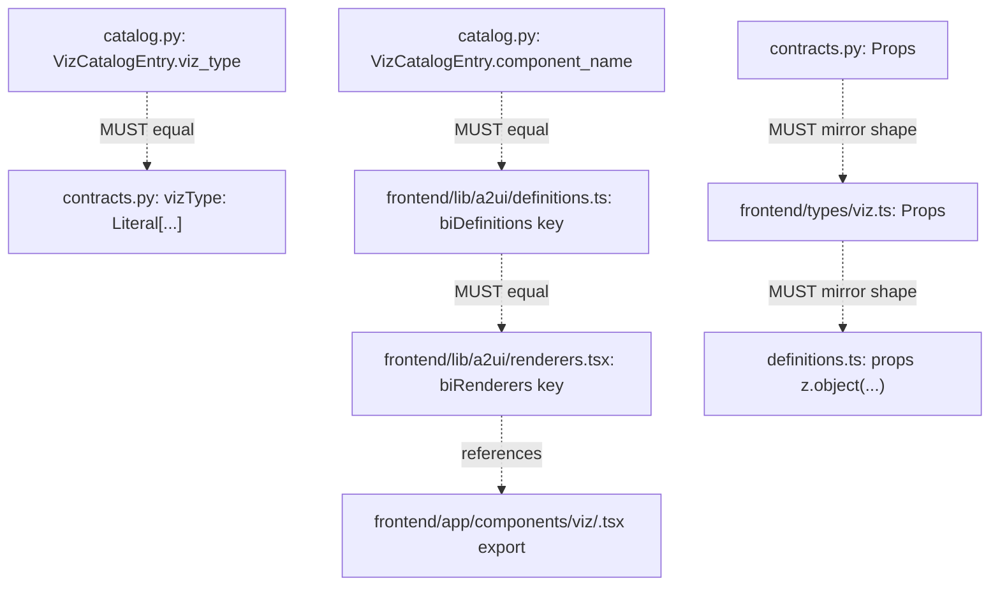
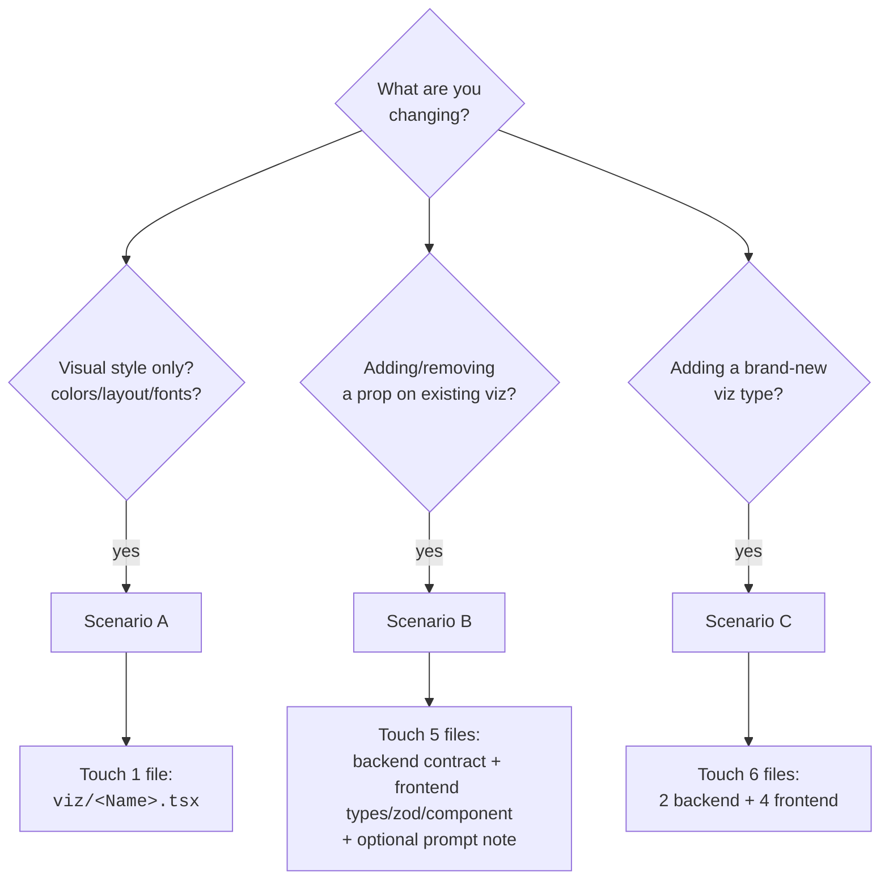
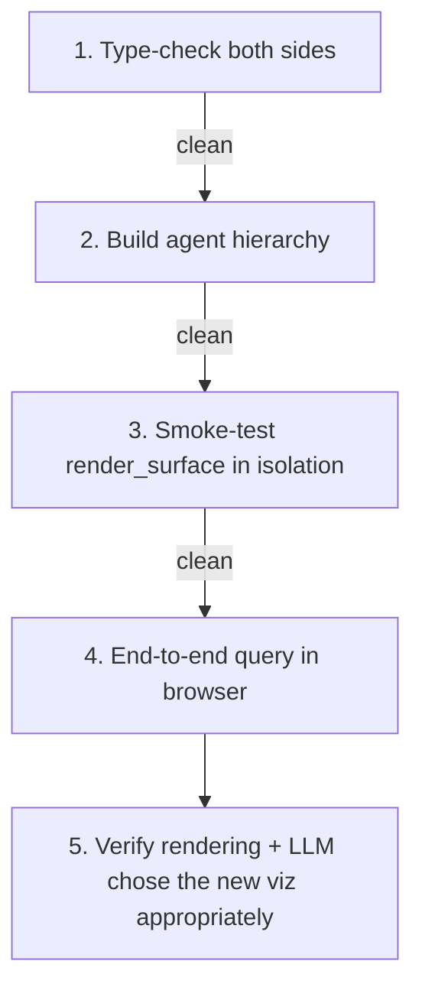

# Maintaining the A2UI Viz Catalog — S&OP

This document is the standard operating procedure for evolving the BI viz catalog. It covers three lifecycle scenarios:

- **Scenario A** — Restyle an existing viz component (visual change only)
- **Scenario B** — Modify an existing viz's props (add/remove/change a field)
- **Scenario C** — Add a brand-new viz component end-to-end

Read the **Architecture** section first to understand which file owns which concern. Then follow the workflow that matches what you are doing.

---

## Architecture

The viz catalog spans the agent backend and the frontend. Each layer has one job; they sync via a shared component-name convention and matching prop schemas.

```mermaid
%%{init: {'flowchart': {'nodeSpacing': 60, 'rankSpacing': 80, 'padding': 20}, 'themeVariables': {'fontSize': '20px'}}}%%
flowchart TD
    subgraph Backend["Agent backend (Python)"]
      direction TB
      C[contracts.py<br/><i>Pydantic schemas</i>]
      CAT[catalog.py<br/><i>VIZ_CATALOG manifest</i>]
      T[tools/a2ui.py<br/><i>render_surface</i>]
      PL[prompt_loader.py]
      MD["prompts/*.md"]
      RULES[_metric_display_rules.md]
      AG[agent factories]
      C --> CAT
      CAT --> T
      CAT --> PL
      RULES --> PL
      PL --> MD
      MD -.->|loaded by| AG
      T -.->|invoked by| AG
    end

    OPS["{a2ui_operations: [...]}"]

    subgraph Frontend["Frontend (TypeScript / React)"]
      direction TB
      MW[CPK a2ui middleware<br/><i>route.ts: a2ui:&#123;&#125;</i>]
      FCAT[lib/a2ui/catalog.ts<br/><i>createCatalog</i>]
      DEFS[lib/a2ui/definitions.ts<br/><i>Zod schemas</i>]
      RND[lib/a2ui/renderers.tsx]
      VTS[types/viz.ts]
      RC["app/components/viz/*.tsx"]
      DOM[Rendered DOM]
      DEFS --> FCAT
      RND --> FCAT
      VTS --> RC
      RC --> RND
      MW --> FCAT
      FCAT --> DOM
    end

    AG -->|tool result| OPS
    OPS --> MW
```



### Layer ownership

| Layer | File | Owner | What it does |
|-------|------|-------|---|
| 1 | `contracts.py` | Backend | Pydantic schemas — what shapes the agent is allowed to emit |
| 2 | `catalog.py` | Backend + product | Manifest: viz_type → component_name + LLM-facing description + selection guidance |
| 3 | `tools/a2ui.py` | Backend | `render_surface` — validates, builds A2UI ops, returns to runtime |
| 4 | `prompts/<agent>.md` | Prompt eng | Persona, workflow, role-specific guidance. Uses `{viz_catalog}` and `{metric_display_rules}` placeholders |
| 5 | `prompts/_metric_display_rules.md` | Prompt eng + data | Shared metric formatting rules (currency vs number vs raw) |
| 6 | `prompt_loader.py` | Backend | Substitutes placeholders at agent build time |
| F1 | `frontend/types/viz.ts` | Frontend | TypeScript prop interfaces (mirror of `contracts.py`) |
| F2 | `frontend/lib/a2ui/definitions.ts` | Frontend | Zod schemas (catalog validation) |
| F3 | `frontend/app/components/viz/*.tsx` | Frontend | Actual React components |
| F4 | `frontend/lib/a2ui/renderers.tsx` | Frontend | Maps catalog component name → React component |
| F5 | `frontend/lib/a2ui/catalog.ts` | Frontend | `createCatalog(...)` — combines definitions + renderers |

### Sync invariants — what MUST match across layers



Drift between any of these silently breaks rendering. Naming conventions enforce most of it; `tsc --noEmit` catches the TypeScript side.

---

## Decision tree — which scenario do I follow?



---

## Scenario A — Restyle an existing viz (visual only)

You are changing how an existing component **looks**. The props (the data contract) stay identical.

### Files to touch

| # | File | Change |
|---|------|--------|
| 1 | `frontend/app/components/viz/<Name>.tsx` | Edit JSX, styles, layout, colors, sub-components |

That is the entire change. No backend changes. No catalog changes. No type changes.

### Why nothing else changes

- Pydantic / Zod schemas are unchanged → validators still pass
- Catalog manifest unchanged → tool emits the same component name
- Prompts unchanged → LLM behavior is identical
- The agent emits the same `{ id, component: "<Name>", title: ..., value: ..., ... }` payload as before — only the React component renders it differently

### How to test

1. Save the file
2. Frontend hot-reloads (no restart needed)
3. Re-run the same query in the chat
4. Visually verify the new style renders correctly

If something looks off, the issue is purely in the TSX file — there is no other surface to debug.

---

## Scenario B — Modify props on an existing viz

You are adding, removing, or changing the type of a field on an existing viz's props. Example: add `accent_color: string | null` to `KPICard`.

### Files to touch (in this order)

| # | File | Change | Why first |
|---|------|--------|-----------|
| 1 | `agent/src/ai_over_bi/contracts.py` | Add/modify field on `<Name>Props` Pydantic class | Agent-side contract first — agent must be ABLE to emit the new shape |
| 2 | `agent/src/ai_over_bi/catalog.py` | Update `props_summary` on the `VizCatalogEntry` for this viz | Prompt content auto-flows through `{viz_catalog}` |
| 3 | `frontend/types/viz.ts` | Mirror the field on the `<Name>Props` interface | Frontend type contract |
| 4 | `frontend/lib/a2ui/definitions.ts` | Update Zod `props` schema for this viz | Catalog accepts the new shape |
| 5 | `frontend/app/components/viz/<Name>.tsx` | Read and apply the new prop | Render the change |

### Optional — only if behavior depends on it

| # | File | When |
|---|------|------|
| 6 | `agent/src/ai_over_bi/agents/prompts/<agent>.md` | If the LLM needs explicit guidance about WHEN to set the new prop. Catalog's `props_summary` lists it; only add to the .md if extra reasoning is needed |

### How to test

```mermaid
sequenceDiagram
    participant Dev
    participant Backend
    participant Frontend
    participant Browser

    Dev->>Backend: Save contracts.py + catalog.py
    Dev->>Backend: Restart (uv run ai-over-bi-serve)
    Note over Backend: Agent picks up new contract<br/>Catalog auto-injects to prompts
    Dev->>Frontend: Save types/zod/component changes
    Note over Frontend: tsc --noEmit (auto in IDE)
    Dev->>Browser: Restart frontend if needed; reload
    Dev->>Browser: Run query exercising the new prop
    Browser->>Backend: query
    Backend->>Backend: Pydantic validates outbound payload
    Backend->>Frontend: a2ui_operations
    Frontend->>Frontend: Zod validates inbound props
    Frontend->>Browser: New rendering with new prop
```

**Validation checks:**

```bash
# Backend types
cd agent && uv run python -c "from ai_over_bi.agents.orchestrator import build_orchestrator; build_orchestrator()"

# Frontend types
cd frontend && npx tsc --noEmit
```

Both must be clean before testing in the browser.

### Common pitfall

If you change Pydantic but forget Zod (or vice versa), the agent emits a payload that the frontend silently rejects (or vice versa). **Always update all 4 files (1, 3, 4, 5) in the same change.** The 5-file rule is non-negotiable for prop changes.

---

## Scenario C — Add a brand-new viz component

You are adding a viz type that does not exist yet — e.g. `HeatMap`, `Funnel`, `Sankey`.

### Files to touch (in this order)

```mermaid
flowchart TD
    subgraph Step1["1. Backend contract"]
      A[contracts.py:<br/>Add HeatMapProps Pydantic class<br/>Add HeatMapPayload<br/>Append to VizPayload union]
    end
    subgraph Step2["2. Backend catalog"]
      B[catalog.py:<br/>Add VizCatalogEntry<br/>viz_type, component_name,<br/>description, when_to_use, props_summary]
    end
    subgraph Step3["3. Frontend types"]
      C[types/viz.ts:<br/>Add HeatMapProps interface]
    end
    subgraph Step4["4. Frontend Zod"]
      D[lib/a2ui/definitions.ts:<br/>Add HeatMap entry to biDefinitions<br/>with Zod props schema]
    end
    subgraph Step5["5. Frontend component"]
      E[app/components/viz/HeatMap.tsx:<br/>Build the React component]
    end
    subgraph Step6["6. Frontend renderer"]
      F[lib/a2ui/renderers.tsx:<br/>HeatMap: ({ props }) => <HeatMap ...props />]
    end

    A --> B
    B --> C
    C --> D
    D --> E
    E --> F
```

### Detailed steps

**1. `agent/src/ai_over_bi/contracts.py`** — define the prop shape and payload class:

```python
class HeatMapProps(BaseModel):
    title: str | None = None
    rows: list[str]
    cols: list[str]
    matrix: list[list[float]]
    color_scale: Literal["sequential", "diverging"] = "sequential"

class HeatMapPayload(BaseModel):
    vizType: Literal["heat_map"] = "heat_map"
    props: HeatMapProps

# Append to the union:
VizPayload = Annotated[
    Union[
        KPICardPayload,
        # ...existing entries...
        HeatMapPayload,
    ],
    Field(discriminator="vizType"),
]
```

**2. `agent/src/ai_over_bi/catalog.py`** — add a manifest entry:

```python
VIZ_CATALOG: tuple[VizCatalogEntry, ...] = (
    # ...existing entries...
    VizCatalogEntry(
        viz_type="heat_map",
        component_name="HeatMap",
        payload_class=HeatMapPayload,
        description="2D matrix heatmap showing intensity across two categorical dimensions.",
        when_to_use="Hour-by-day patterns, store-by-week density. Best when both axes are categorical.",
        props_summary="{ title?, rows: string[], cols: string[], matrix: number[][], color_scale? }",
    ),
)
```

**3. `frontend/types/viz.ts`** — mirror the prop interface:

```typescript
export interface HeatMapProps {
  title?: string;
  rows: string[];
  cols: string[];
  matrix: number[][];
  color_scale?: "sequential" | "diverging";
}
```

**4. `frontend/lib/a2ui/definitions.ts`** — add Zod schema:

```typescript
HeatMap: {
  description: "2D matrix heatmap.",
  props: z.object({
    title: z.string().optional(),
    rows: z.array(z.string()),
    cols: z.array(z.string()),
    matrix: z.array(z.array(z.number())),
    color_scale: z.enum(["sequential", "diverging"]).optional(),
  }),
},
```

**5. `frontend/app/components/viz/HeatMap.tsx`** — build the component:

```tsx
"use client";
import type { HeatMapProps } from "@/types/viz";

export function HeatMap(props: HeatMapProps) {
  // ...your visual implementation
}
```

**6. `frontend/lib/a2ui/renderers.tsx`** — register:

```tsx
import { HeatMap } from "@/app/components/viz/HeatMap";

export const biRenderers: CatalogRenderers<BIDefinitions> = {
  // ...existing entries...
  HeatMap: ({ props }) => <HeatMap {...props} />,
};
```

### How to test



**Step 1 — Type checks:**

```bash
# Backend
cd agent && uv run python -c "from ai_over_bi.contracts import VizPayload; from ai_over_bi.catalog import VIZ_CATALOG; print(len(VIZ_CATALOG))"

# Frontend
cd frontend && npx tsc --noEmit
```

**Step 2 — Build agent hierarchy:**

```bash
cd agent && uv run python -c "from ai_over_bi.agents.orchestrator import build_orchestrator; o = build_orchestrator(); print('OK')"
```

**Step 3 — Smoke-test the render_surface tool with the new viz type via ADK web:**

```bash
cd agent && uv run adk web src
```

Open the ADK harness, send a query that should trigger the new viz, inspect the `render_surface` tool result. Look for:
- Top-level `a2ui_operations` key (no `result` wrapping)
- A component with `"component": "HeatMap"` and the prop shape matching your Zod schema

**Step 4 — End-to-end via the chat UI:**

Restart backend (`uv run ai-over-bi-serve`) and frontend (`npm run dev`). Run a query that should naturally select the new viz. Verify:
- The viz renders (no console errors about unknown component)
- Props arrive correctly (no Zod parse warnings in browser console)
- The LLM chose the new viz when appropriate (this is what `when_to_use` in catalog.py drives)

### Common pitfalls

| Pitfall | Symptom | Fix |
|---------|---------|-----|
| `component_name` in `catalog.py` doesn't match key in `definitions.ts` | Frontend renders nothing or "unknown component" warning | Rename to match — they MUST be byte-identical |
| Forgot to append `HeatMapPayload` to the `VizPayload` union in `contracts.py` | Agent's `render_surface` rejects the payload at Pydantic validation | Add to union |
| Zod schema stricter than Pydantic | Agent emits valid output, frontend silently drops it | Loosen Zod or tighten Pydantic — they must agree |
| `viz_type` in `catalog.py` doesn't match `Literal[...]` in `contracts.py` | `_VIZ_TYPE_TO_COMPONENT.get()` returns None, viz silently skipped in render | Make them match |
| Forgot `"use client"` in the new TSX | Next.js error at build time | Add `"use client"` directive at top of the file |
| LLM never picks the new viz | `when_to_use` in catalog.py is too vague | Sharpen the guidance — give a concrete trigger |

---

## Quick reference — what the agent sees

When you call `load_prompt("data_query.md")`, the loader substitutes `{viz_catalog}` with the rendered manifest. The LLM literally sees this for each viz:

```
- **kpi_card** (KPICard) — Single metric summary card with optional delta badge and sparkline trend.
  Use when: Headline metric overview. Use 3–4 kpi_cards in a row for a summary; one alone for a single hero metric.
  Props: `{ title, value, unit?, value_format?, delta?: {...}, trend?: [...], subtitle? }`
```

The three fields you control in `catalog.py` map directly:
- `description` → "Single metric summary card..."
- `when_to_use` → "Use when: Headline metric overview..."
- `props_summary` → the `Props:` line

Edit any of these in `catalog.py` and both `data_query.md` and `analyst.md` pick it up automatically on next agent build.

---

## Editing shared metric rules

The metric formatting rules (when to use `currency` vs `number`, why `guest_count` is never money, etc.) live in **one** file:

```
agent/src/ai_over_bi/agents/prompts/_metric_display_rules.md
```

Both sub-agents include it via the `{metric_display_rules}` placeholder. Edit once; both pick it up on next agent build.

Add new metric rules here when introducing a new metric to the system (e.g. if QuickBite adds `loyalty_redemptions` as a metric, append a rule here describing its display format).

---

## Versioning the catalog (future)

If we ever need to evolve the catalog incompatibly (e.g. rename `kpi_card` → `metric_card`), the safe path is:

1. Bump `BI_CATALOG_ID` in both `tools/a2ui.py` and `frontend/lib/a2ui/catalog.ts` (e.g. `bi/v1` → `bi/v2`)
2. Maintain the old catalog ID alongside the new one for a deprecation window
3. Update agent prompts to prefer the new naming
4. Once usage migrates, drop the old catalog ID

Catalog ID is a URI by design — it lets multiple catalogs coexist on a CPK runtime.

---

## When in doubt

- Visual change → Scenario A → 1 file
- Existing data shape change → Scenario B → 5 files
- New viz altogether → Scenario C → 6 files
- Catalog selection guidance → 1 field in `catalog.py`
- Metric formatting rule → `_metric_display_rules.md`
- Agent persona / workflow → `prompts/<agent>.md`

If you can't tell which scenario, ask: "is the agent emitting a different payload?" If yes → B or C. If no → A.
