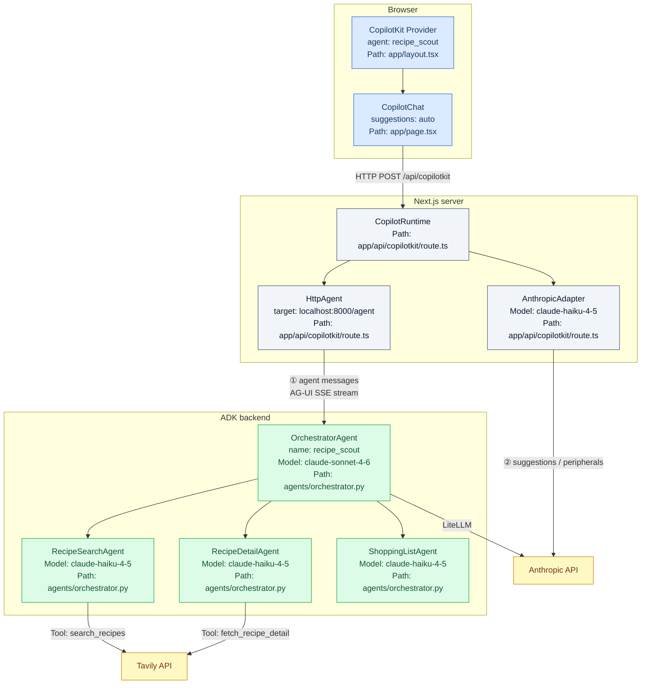
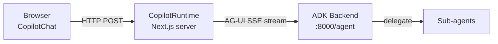

# Recipe Scout — System Architecture

AI-powered recipe discovery assistant. The user chats via a CopilotKit frontend; an ADK multi-agent backend does the work; all three are wired together with the AG-UI protocol.

## Component overview

> **Key point:** `/api/copilotkit` is a Next.js API route running server-side on
> the same host as the frontend. `CopilotRuntime` proxies all agent traffic —
> the browser never talks directly to the ADK backend.

## Request paths

There are two separate paths through the runtime:

| Path | Trigger | Adapter | Destination |
|------|---------|---------|-------------|
| Agent messages | User sends a chat message | `HttpAgent` | ADK backend `:8000/agent` via AG-UI |
| Peripheral ops | Suggestion generation, `CopilotTask` | `AnthropicAdapter` (Haiku) | Anthropic API directly |

The two paths share the same `CopilotRuntime` instance but never cross. Agent reasoning always happens in the ADK backend; CopilotKit's Haiku adapter is only used for UI-layer LLM work.

## Protocol stack

Three protocols are used across the full F1–F5 roadmap:

- **AG-UI** — streaming event bus between frontend and ADK agent (F1–F3)
- **MCP** — connect external tool servers to ADK agent as toolsets (F4)
- **A2A** — promote sub-agents to standalone network services (F5)

See [protocols.md](./protocols.md) for full sequence diagrams per protocol.

## Feature milestones

| # | Protocol | Feature | Status |
|---|----------|---------|--------|
| F1 | AG-UI | Chat + streaming + suggestions | Done |
| F2 | AG-UI | Recipe cards — Generative UI from agent state | Planned |
| F3 | AG-UI | Recipe detail + human-in-the-loop selection | Planned |
| F4 | MCP | Ingredient lookup / substitutions via MCP server | Planned |
| F5 | A2A | Shopping list sub-agent as standalone A2A service | Planned |

## Further reading

- [protocols.md](./protocols.md) — AG-UI, MCP, A2A sequence diagrams
- [copilotkit-internals.md](./copilotkit-internals.md) — CopilotRuntime, adapters, hooks, rendering pipeline
- [backend-agents.md](./backend-agents.md) — ADK hierarchy, tools, session state, LiteLLM bridge
