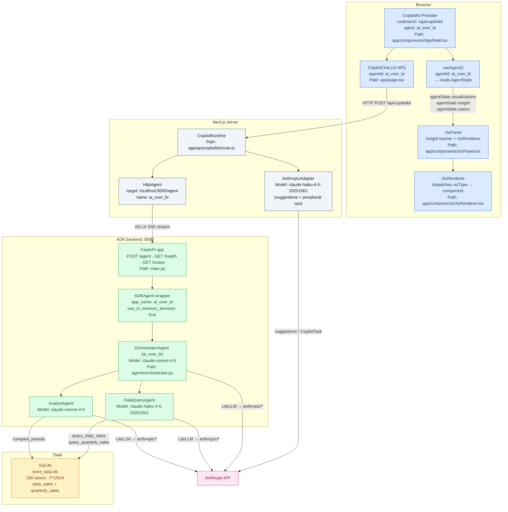
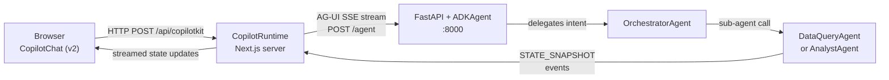
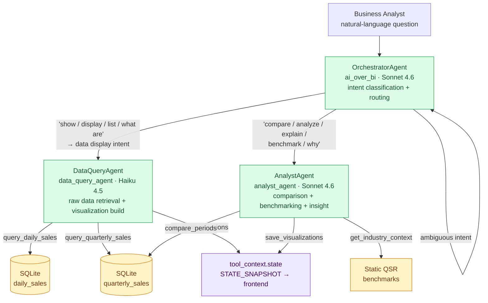
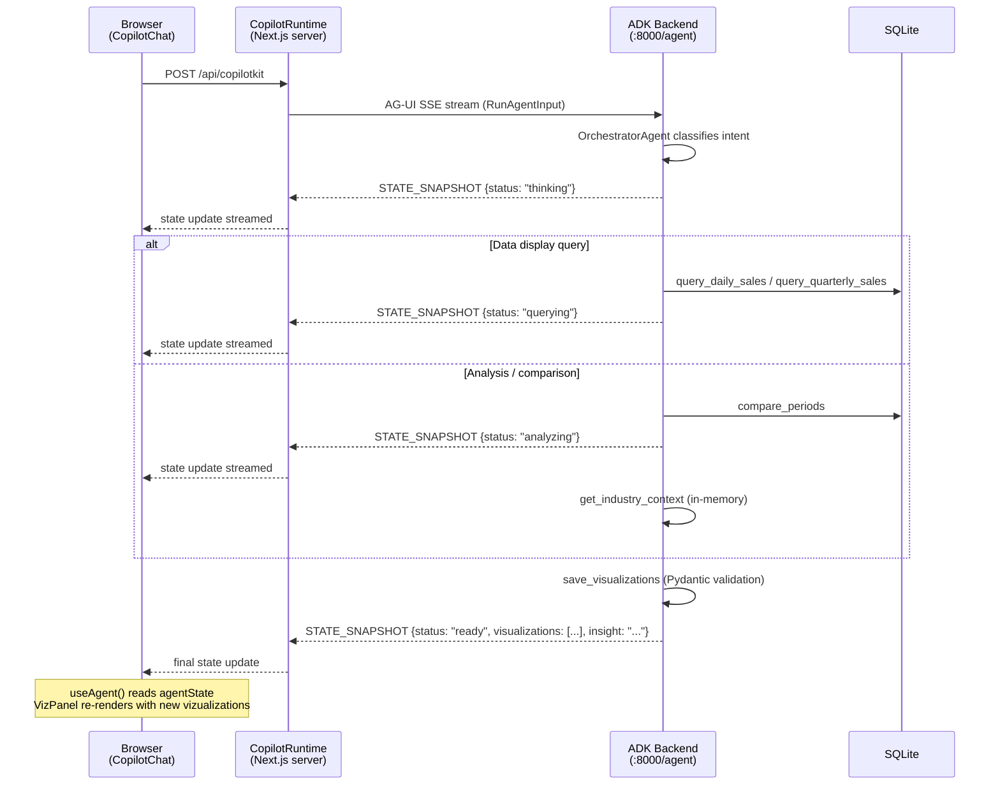
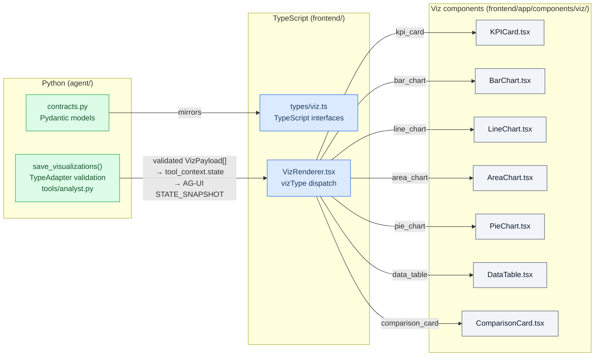
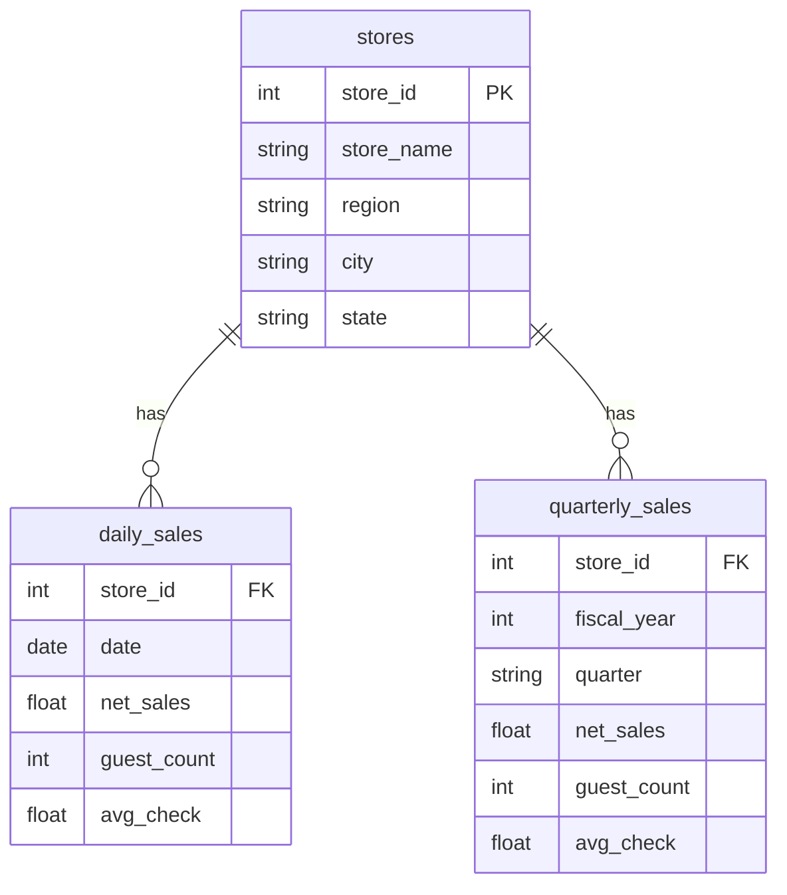

# AI over BI — System Architecture

AI-powered business intelligence for QuickBite restaurant chain. Business analysts ask natural-language questions via a CopilotKit chat frontend; a Google ADK multi-agent backend queries SQLite, computes period comparisons, benchmarks against QSR industry data, and streams typed `VizPayload[]` to the frontend, which renders the right chart or table components automatically.

## Component overview

> **Key point:** `/api/copilotkit` is a Next.js App Router API route running server-side.
> `CopilotRuntime` proxies all agent traffic via `HttpAgent` — the browser never talks
> directly to the ADK backend. The `AnthropicAdapter` is a separate, parallel path
> used exclusively for CopilotKit peripheral operations (suggestions, `CopilotTask`).

## Request paths

There are two separate paths through the runtime:

| Path | Trigger | Transport | Destination |
|------|---------|-----------|-------------|
| Agent messages | User sends a chat message | `HttpAgent` → AG-UI SSE stream | ADK backend `localhost:8000/agent` |
| Peripheral ops | Suggestion generation, `CopilotTask` | Direct HTTP | Anthropic API (Haiku) |

The two paths share the same `CopilotRuntime` instance but never cross. All agent reasoning, tool execution, and state mutations happen in the ADK backend. CopilotKit's Haiku adapter is only for UI-layer LLM operations.

## Protocol stack

Three protocols span the full F1–F5 roadmap:

- **AG-UI** — streaming event bus between CopilotKit and the ADK agent (F1–F3, currently active)
- **MCP** — attach external tool servers to ADK agents as toolsets (F4 — planned)
- **A2A** — promote `AnalystAgent` to a standalone networked service (F5 — planned)

See [protocols.md](./protocols.md) for full sequence diagrams per protocol.

## Agent hierarchy and routing

### Routing rules (OrchestratorAgent)

| Intent signal | Target sub-agent |
|---------------|-----------------|
| "Show me", "display", "list", "what are", "give me" | `data_query_agent` |
| "Compare", "analyze", "explain", "benchmark", "why", "how did X vs Y" | `analyst_agent` |
| Ambiguous | One clarifying question, max |

### DataQueryAgent tools

| Tool | group_by options | Sets status |
|------|-----------------|-------------|
| `query_daily_sales(date_from, date_to, regions, store_ids, group_by)` | `day \| week \| month \| store \| region` | `"querying"` |
| `query_quarterly_sales(quarters, regions, store_ids, group_by)` | `quarter \| store \| region` | `"querying"` |
| `save_visualizations(visualizations, insight)` | — | `"ready"` |

Both query tools return `{"rows": [...], "row_count": int}` where every row has a `label` column (aliased in SQL) plus `net_sales`, `guest_count`, `avg_check`.

### AnalystAgent tools

| Tool | Purpose | Sets status |
|------|---------|-------------|
| `compare_periods(metric, period1_quarters, period1_label, period2_quarters, period2_label, level, regions)` | Period-over-period delta at total / region / store level | `"analyzing"` |
| `get_industry_context(metric, period)` | Static QSR benchmarks + seasonality index + driving factors | — |
| `save_visualizations(visualizations, insight)` | Validate + persist VizPayload[] to state | `"ready"` |

`compare_periods` returns `{comparisons: [{label, period1_value, period2_value, abs_delta, pct_delta, direction}]}`. For `level="store"` it caps at top-20 stores by period2 metric.

`get_industry_context` returns static benchmarks (e.g., QSR avg quarterly per store, comp sales benchmark %, seasonality index by quarter, driving factors). Extension point for F4/MCP — replace the static return with a live Tavily web search without changing the AnalystAgent instruction.

## AG-UI state lifecycle

### State fields

| Field | Type | Updated by |
|-------|------|------------|
| `status` | `"idle" \| "thinking" \| "querying" \| "analyzing" \| "ready" \| "error"` | Each tool call, `save_visualizations` sets `"ready"` |
| `session_id` | `string \| null` | First query tool call |
| `visualizations` | `VizPayload[]` | `save_visualizations` only |
| `insight` | `string \| null` | `save_visualizations` only |
| `error` | `string \| null` | `save_visualizations` (validation errors) |

## VizPayload contract architecture

### VizPayload discriminated union

| `vizType` | Props key fields | Typical use |
|-----------|-----------------|-------------|
| `kpi_card` | `title, value, unit, value_format, delta?, trend?` | Single metric summary; delta badge + sparkline |
| `comparison_card` | `title, metric, current, prior, delta, insight?` | Period-over-period — leads analyst responses |
| `bar_chart` | `data[{label,…}], series[], layout, value_format` | Store/region rankings (`layout="horizontal"`), quarterly breakdown |
| `line_chart` | `data[{label,…}], series[], show_dots, value_format` | Monthly / weekly trends |
| `area_chart` | `data[{label,…}], series[], stacked, value_format` | Cumulative or stacked time-series |
| `pie_chart` | `data[{label,value}], inner_radius, value_format` | Sales mix by region (donut: `inner_radius=60`) |
| `data_table` | `columns[{key,label,type,align}], rows[]` | Full detail drilldown — always included alongside charts |

**Invariant:** every `data` row in bar / line / area charts must use `"label"` as the category key. SQL queries alias the grouping column to `label` automatically. Invalid payloads are rejected by Pydantic inside `save_visualizations` — they do not crash the agent; `rejected > 0` is surfaced back to the LLM.

**Swap contract:** replacing Recharts with Nivo only requires editing component internals in `frontend/app/components/viz/*.tsx`. The `VizPayload` types and `VizRenderer` dispatch logic are not touched.

## Data layer

| Table | Rows | Notes |
|-------|------|-------|
| `stores` | 100 | 5 regions: Northeast, Southeast, Midwest, Southwest, West |
| `daily_sales` | 36,600 | Jan 1 – Dec 31 2024; day-of-week + monthly seasonality patterns |
| `quarterly_sales` | 400 | Q1–Q4 2024 pre-aggregated per store (100 stores × 4 quarters) |

Metrics throughout: `net_sales` (USD revenue), `guest_count` (visit count — never currency-formatted), `avg_check` (USD per guest).

Database path: `agent/src/ai_over_bi/data/store_data.db` — generated once via `uv run ai-over-bi-seed`.

## Configuration

| Setting | Default | Env override |
|---------|---------|-------------|
| `ORCHESTRATOR_MODEL` | `claude-sonnet-4-6` | `ORCHESTRATOR_MODEL` |
| `SUBAGENT_MODEL` | `claude-haiku-4-5-20251001` | `SUBAGENT_MODEL` |
| `DB_PATH` | `…/data/store_data.db` | `DB_PATH` |
| `PORT` | `8000` | `PORT` |
| `SESSION_TIMEOUT_SECONDS` | `3600` | `SESSION_TIMEOUT_SECONDS` |

LiteLLM bridges ADK's `LlmAgent` to Anthropic. The `config.py` `model_validator` exports `ANTHROPIC_API_KEY` to `os.environ` at startup so LiteLLM picks it up without additional configuration.

## Feature milestones

| # | Protocol | Feature | Status |
|---|----------|---------|--------|
| F1 | AG-UI | Chat + streaming + agent suggestions | Done |
| F2 | AG-UI | Generative UI — agent builds `VizPayload[]` from data | Done |
| F3 | AG-UI | Human-in-the-loop store / period selection | Planned |
| F4 | MCP | Live QSR industry benchmarks via web MCP (replaces `get_industry_context` static data) | Planned |
| F5 | A2A | `AnalystAgent` promoted to standalone A2A service | Planned |

## Further reading

- [protocols.md](./protocols.md) — AG-UI, MCP, A2A sequence diagrams
- [AGENTS.md](../AGENTS.md) — agent tools, state contract, VizPayload union, extension points
- [backend-agents.md](./backend-agents.md) — ADK hierarchy, tools, session state, LiteLLM bridge
- [adk-copilotkit-primer.md](./adk-copilotkit-primer.md) — how ADK and CopilotKit wire together
