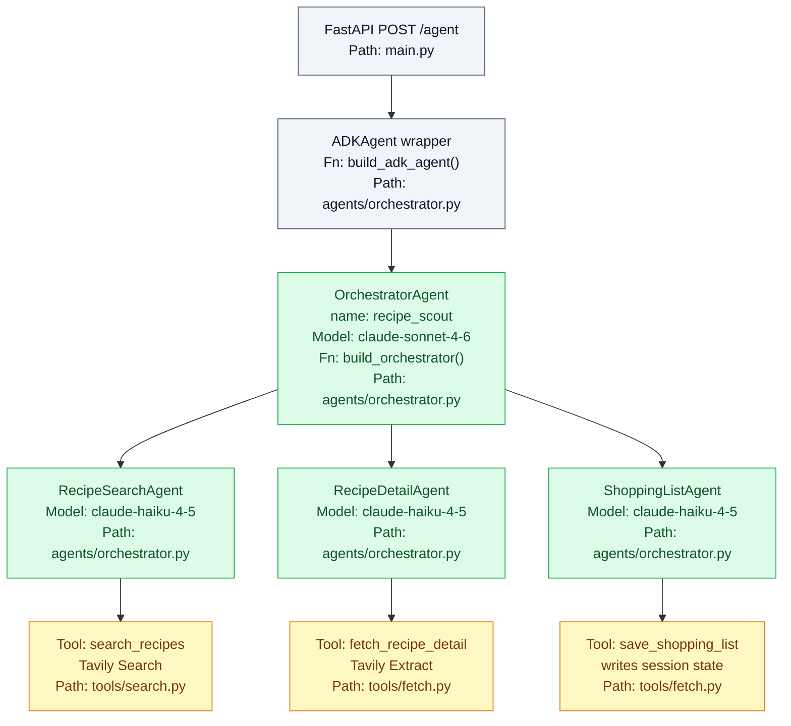
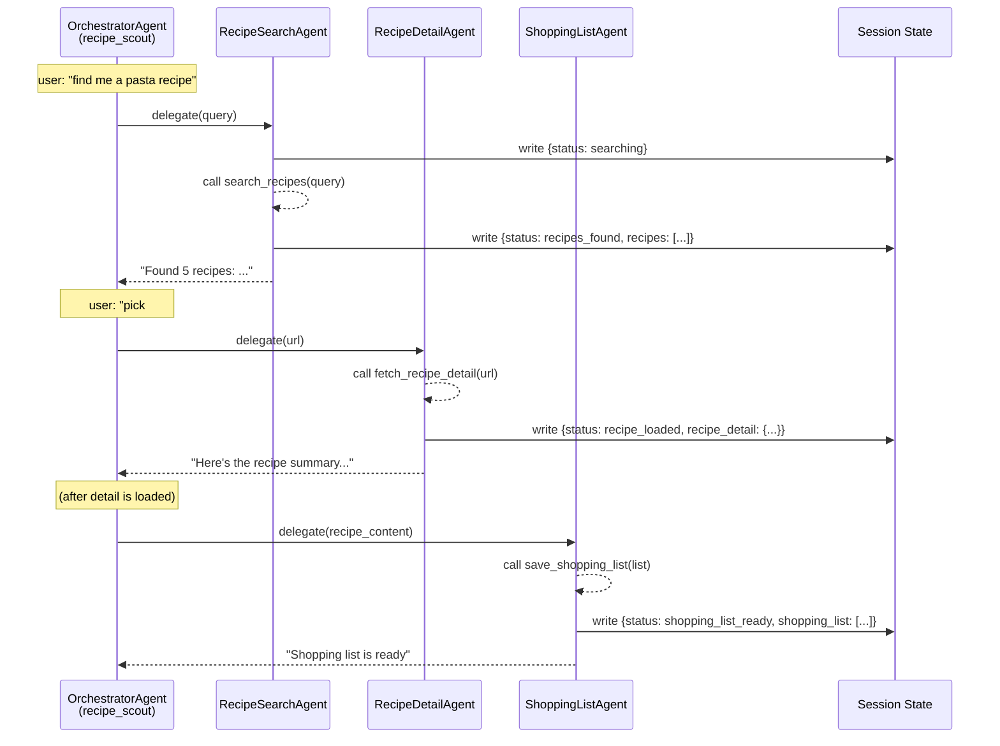

# Recipe Scout — Backend Agents

> Double-click on the **ADK backend** box from [architecture.md](./architecture.md).
> Covers the agent hierarchy, tools, session state, and the LiteLLM bridge. Also documents planned extensions F4 (MCP) and F5 (A2A).

---

## Agent hierarchy



The orchestrator uses `claude-sonnet-4-6` for conversation management and delegation reasoning. Sub-agents use `claude-haiku-4-5-20251001` — each does one focused job and is fast + cheap.

---

## LiteLLM bridge

ADK supports multiple model providers. This project uses `LiteLlm` to call Anthropic models — it bridges ADK's internal model interface to the `litellm` library, which translates to Anthropic's API format.

```python
from google.adk.models.lite_llm import LiteLlm

orchestrator = LlmAgent(
    name="recipe_scout",
    model=LiteLlm(model="anthropic/claude-sonnet-4-6"),
    ...
)
```

`LiteLLM` picks up the `ANTHROPIC_API_KEY` from `os.environ`. The `config.py` `model_validator` exports the key there after pydantic-settings loads it from `agent/.env`:

```python
# config.py
from pydantic_settings import BaseSettings
from pydantic import model_validator

class Settings(BaseSettings):
    ANTHROPIC_API_KEY: str
    TAVILY_API_KEY: str
    ORCHESTRATOR_MODEL: str = "claude-sonnet-4-6"
    SUBAGENT_MODEL: str = "claude-haiku-4-5-20251001"
    SESSION_TIMEOUT_SECONDS: int = 3600

    @model_validator(mode="after")
    def export_to_environ(self) -> "Settings":
        # LiteLLM reads from os.environ — must be set before agents are built
        import os
        os.environ["ANTHROPIC_API_KEY"] = self.ANTHROPIC_API_KEY
        return self
```

---

## Tools

### `search_recipes` (Tavily Search)

- **Input**: `query: str` — descriptive natural language recipe query
- **Action**: calls Tavily Search API, returns up to 5 results
- **Side effect**: writes `recipes` list and `status: "recipes_found"` to ADK session state
- **State update**: emitted to frontend as `STATE_SNAPSHOT` event

### `fetch_recipe_detail` (Tavily Extract)

- **Input**: `url: str` — exact recipe URL from a previous search result
- **Action**: calls Tavily Extract to fetch full page content
- **Side effect**: writes `recipe_detail` object and `status: "recipe_loaded"` to session state
- **State update**: emitted as `STATE_SNAPSHOT` event

### `save_shopping_list`

- **Input**: `shopping_list: list[ShoppingCategory]` — structured list with category + items
- **Action**: writes to ADK session state
- **Side effect**: sets `status: "shopping_list_ready"` in session state
- **State update**: emitted as `STATE_SNAPSHOT` event

---

## Session state schema

ADK session state is a dict stored in-memory per session (`use_in_memory_services=True`). It is serialized and emitted to the frontend as an AG-UI `STATE_SNAPSHOT` event whenever a tool writes to it.

```json
{
  "status": "idle | searching | recipes_found | recipe_loaded | shopping_list_ready",
  "recipes": [
    {
      "title": "string",
      "url": "string",
      "description": "string",
      "source": "string"
    }
  ],
  "recipe_detail": {
    "url": "string",
    "content": "string"
  },
  "shopping_list": [
    {
      "category": "Produce | Proteins | Dairy & Eggs | Pantry | Bakery",
      "items": ["string"]
    }
  ]
}
```

The frontend reads this state via `useCoAgent` (planned for F2/F3) to drive recipe cards and shopping list UI outside the chat bubble.

---

## AG-UI integration (`ag-ui-adk`)

`ADKAgent` from `ag_ui_adk` wraps the ADK orchestrator and adapts it to the AG-UI protocol. It handles:

- Session creation / resumption per request
- Converting ADK events (`LlmResponse`, `FunctionCallEvent`, state mutations) into AG-UI SSE events
- Sending `STATE_SNAPSHOT` events whenever session state changes

```python
# orchestrator.py
from ag_ui_adk import ADKAgent

def build_adk_agent() -> ADKAgent:
    orchestrator = build_orchestrator()
    return ADKAgent(
        adk_agent=orchestrator,
        app_name="recipe_scout",
        user_id="demo_user",
        session_timeout_seconds=settings.SESSION_TIMEOUT_SECONDS,
        use_in_memory_services=True,
    )
```

The FastAPI app in `main.py` mounts this agent on `POST /agent`:

```python
# main.py (simplified)
from ag_ui_adk import create_ag_ui_router

agent = build_adk_agent()
app.include_router(create_ag_ui_router(agent), prefix="/agent")
```

---

## Orchestrator delegation flow



---

## F4 — MCP toolsets (planned)

In F4, `MCPToolset` from ADK is used to connect an external MCP server. The toolset provides `search`/`extract`-style tools from a Brave Search MCP server for ingredient lookups and substitution queries.

```python
# tools/mcp_tools.py (F4, planned)
from google.adk.tools.mcp_tool.mcp_toolset import MCPToolset, StdioServerParameters
from recipe_scout.config import settings

def build_ingredient_toolset() -> MCPToolset:
    return MCPToolset(
        connection_params=StdioServerParameters(
            command="npx",
            args=["-y", "@modelcontextprotocol/server-brave-search"],
            env={"BRAVE_API_KEY": settings.BRAVE_API_KEY},
        )
    )
```

`MCPToolset` is passed to the relevant `LlmAgent` alongside existing function tools. ADK converts the MCP server's tool manifest into ADK-compatible `FunctionTool` instances at connection time.

---

## F5 — A2A: ShoppingListAgent as standalone service (planned)

In F5, `ShoppingListAgent` is extracted from the in-process hierarchy and deployed as a separate FastAPI service. ADK provides `A2AServer` to expose it, and `RemoteA2aAgent` for the orchestrator to call it over the network.

### Exposing the service

```python
# shopping_service/main.py (F5, planned)
from google.adk.a2a import A2AServer

shopping_agent = LlmAgent(
    name="shopping_list_agent",
    model=LiteLlm(model=f"anthropic/{settings.SUBAGENT_MODEL}"),
    instruction=_SHOPPING_INSTRUCTION,
    tools=[save_shopping_list],
)

server = A2AServer(agent=shopping_agent)
app = server.to_fastapi()  # mounts A2A protocol endpoints
```

### Consuming from the orchestrator

```python
# agents/orchestrator.py (F5 planned modification)
from google.adk.a2a import RemoteA2aAgent

remote_shopping_agent = RemoteA2aAgent(
    url=settings.SHOPPING_LIST_AGENT_URL,  # http://localhost:9001
    name="shopping_list_agent",
)

orchestrator = LlmAgent(
    name="recipe_scout",
    model=LiteLlm(model=f"anthropic/{settings.ORCHESTRATOR_MODEL}"),
    instruction=_ORCHESTRATOR_INSTRUCTION,
    sub_agents=[recipe_search_agent, recipe_detail_agent, remote_shopping_agent],
)
```

From the orchestrator's perspective, `RemoteA2aAgent` behaves identically to a local `LlmAgent` sub-agent. ADK handles all network communication, serialization, and error handling transparently.

---

## Ports and health check

| Service | Port | Endpoint |
|---------|------|----------|
| ADK backend (F1–F4) | 8000 | `POST /agent` (AG-UI), `GET /health` |
| Orchestrator (F5) | 9000 | `POST /agent` |
| Shopping service (F5) | 9001 | A2A protocol endpoints |
| Frontend | 3000 | `http://localhost:3000` |

---

## Key commands

```bash
# Run full stack
./start.sh

# Backend only
cd agent && uv run recipe-scout-serve

# Interactive agent testing (no frontend)
cd agent && uv run adk web src

# Tests
cd agent && uv run pytest tests/ -v

# Lint + type check
cd agent && uv run ruff check src/ && uv run mypy src/
```
