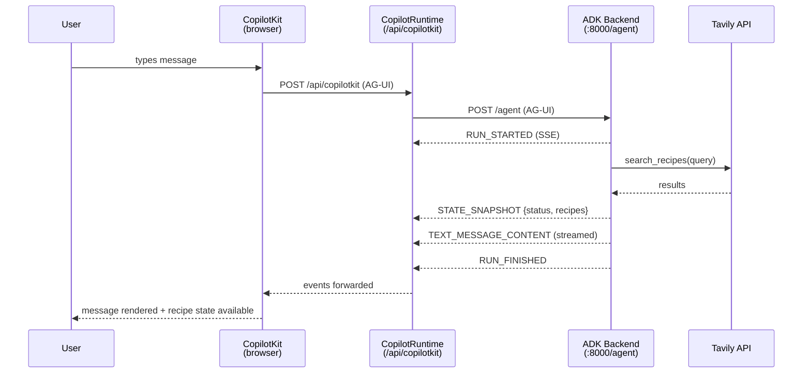
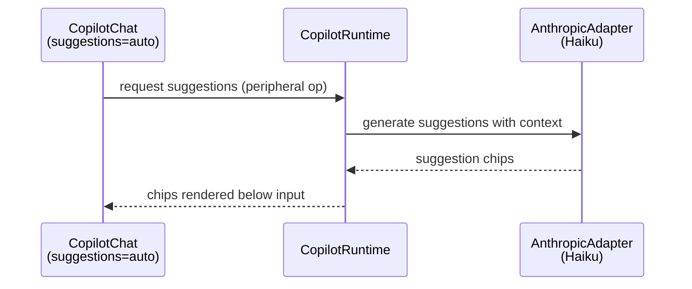
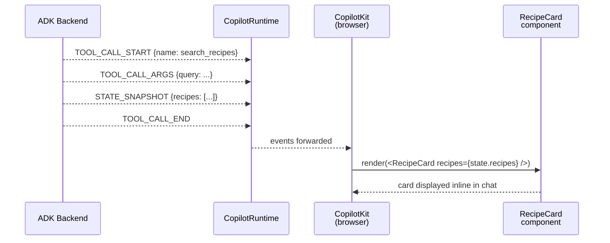
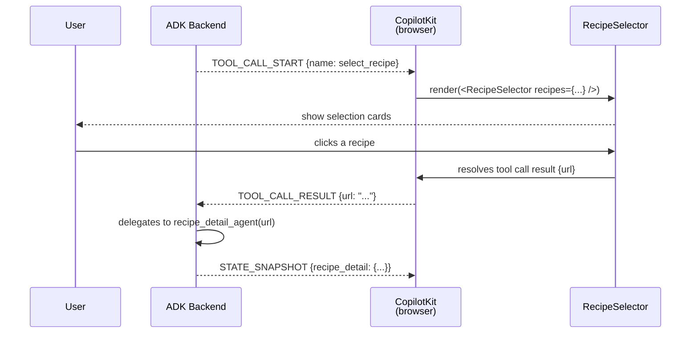
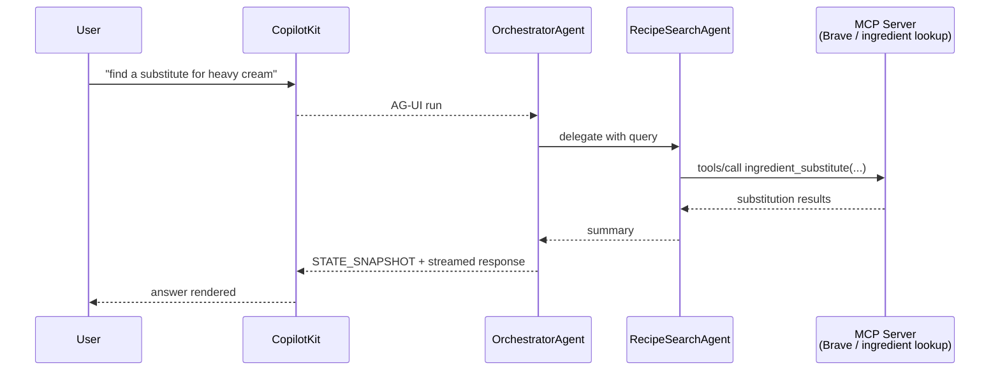
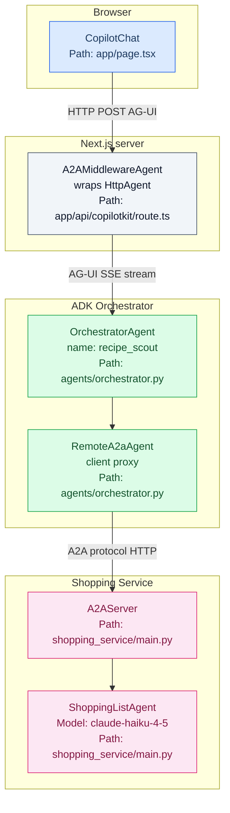
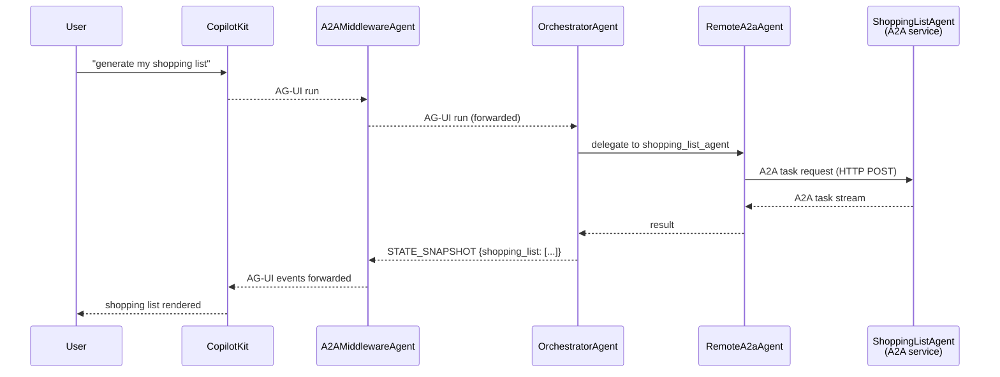

# Recipe Scout — Agentic Protocols

> Double-click on the **protocol layer** from [architecture.md](./architecture.md).
> Three protocols wire together the F1–F5 roadmap. Each section covers what the protocol does, where it is wired in the code, and what the runtime sequence looks like.

---

## AG-UI (F1–F3)

AG-UI is the core streaming protocol between the CopilotKit frontend and any AG-UI-compatible agent backend. It defines a set of typed server-sent events (SSE) that carry text, tool calls, and agent state from agent → frontend in real time.

### What it enables

| Milestone | AG-UI capability used |
|-----------|----------------------|
| F1 | Streaming chat, `STATE_SNAPSHOT` events, suggestion generation |
| F2 | `TOOL_CALL_START` / `TOOL_CALL_END` events → Generative UI rendering via `useFrontendTool` / `useRenderToolCall` |
| F3 | Frontend tool with async `await` → human-in-the-loop (agent pauses, waits for user confirmation) |

### Key AG-UI event types

| Event | Direction | When emitted |
|-------|-----------|-------------|
| `RUN_STARTED` | agent → frontend | Start of agent turn |
| `TEXT_MESSAGE_CONTENT` | agent → frontend | Each streamed text chunk |
| `TOOL_CALL_START` | agent → frontend | Agent begins calling a tool |
| `TOOL_CALL_ARGS` | agent → frontend | Tool arguments stream in |
| `TOOL_CALL_END` | agent → frontend | Tool call complete |
| `STATE_SNAPSHOT` | agent → frontend | Full session state dump |
| `STATE_DELTA` | agent → frontend | Partial/predictive state update |
| `RUN_FINISHED` | agent → frontend | Agent turn complete |
| `TOOL_CALL_RESULT` | frontend → agent | Result of a frontend tool execution |

### F1 — Chat + streaming + suggestions



**Suggestion flow** (runs on a separate path through `AnthropicAdapter`):



### F2 — Generative UI from agent state

The agent emits `TOOL_CALL_START` / `TOOL_CALL_END` events when it calls `search_recipes` or `fetch_recipe_detail`. The frontend registers a renderer using `useFrontendTool` (or `useRenderToolCall` in v2) that maps those tool events to React components.



**Frontend registration** (planned for F2):
```tsx
// app/page.tsx
useFrontendTool({
  name: "search_recipes",
  description: "Search for recipes",
  parameters: z.object({ query: z.string() }),
  render: ({ args, result }) => <RecipeSearchCard query={args.query} recipes={result} />,
});
```

### F3 — Human-in-the-loop (recipe selection)

The agent fetches recipe detail only after the user explicitly selects a recipe. The frontend tool `render` function returns a selection UI; the agent's tool call awaits the result before continuing.



---

## MCP — Model Context Protocol (F4)

MCP is a client-server protocol for exposing tools (functions), resources (data), and prompt templates to LLM agents. In F4, the ADK backend acts as an MCP **client**, connecting to an external MCP **server** (e.g. Brave Search, a custom ingredient lookup service) and making its tools available to the orchestrator.

### What it enables

- Ingredient substitution lookup without writing custom tool code
- Any MCP-compatible tool server can be plugged in
- MCP UI properties propagate all the way to the frontend via AG-UI

### ADK MCP integration

ADK uses `MCPToolset` to connect to an MCP server and convert its tools into ADK-compatible function tools:

```python
# agent/src/recipe_scout/tools/mcp_tools.py  (F4, planned)
from google.adk.tools.mcp_tool.mcp_toolset import MCPToolset, StdioServerParameters

ingredient_tools = MCPToolset(
    connection_params=StdioServerParameters(
        command="npx",
        args=["-y", "@modelcontextprotocol/server-brave-search"],
        env={"BRAVE_API_KEY": settings.BRAVE_API_KEY},
    )
)
```

The toolset is added to whichever sub-agent needs it:

```python
recipe_search_agent = LlmAgent(
    name="recipe_search_agent",
    model=subagent_model,
    instruction=_SEARCH_INSTRUCTION,
    tools=[search_recipes, *ingredient_tools],   # MCP tools added here
)
```

### F4 sequence



---

## A2A — Agent-to-Agent Protocol (F5)

A2A is a network protocol that lets independently deployed agents communicate with each other using a standardized JSON/HTTP interface. In F5, the `ShoppingListAgent` is promoted from an in-process ADK sub-agent to a standalone A2A service. The orchestrator connects to it using ADK's `RemoteA2aAgent`.

CopilotKit bridges the gap between A2A and the frontend using `@ag-ui/a2a-middleware` — the middleware wraps the orchestrator (which is still an AG-UI agent) and injects A2A sub-agent capabilities into the AG-UI event stream.

### When to use A2A vs local sub-agents

| Factor | Local sub-agent | A2A agent |
|--------|----------------|-----------|
| Communication | In-process, in-memory | Network, HTTP/JSON |
| Latency | Near-zero | Network overhead |
| Team ownership | Same team / same repo | Different team or service |
| Deployment | Single process | Independent service |
| Use case (this project) | F1–F4 | F5: shopping list as standalone service |

### F5 architecture



### F5 sequence



### CopilotRuntime config for F5

```ts
// app/api/copilotkit/route.ts (F5 planned)
import { A2AMiddlewareAgent } from "@ag-ui/a2a-middleware";
import { HttpAgent } from "@ag-ui/client";

const orchestratorAgent = new HttpAgent({ url: "http://localhost:9000/agent" });

const agent = new A2AMiddlewareAgent({
  agent: orchestratorAgent,
  a2aAgents: [
    { url: process.env.SHOPPING_LIST_AGENT_URL || "http://localhost:9001" },
  ],
});

const runtime = new CopilotRuntime({
  agents: { recipe_scout: agent },
});
```
