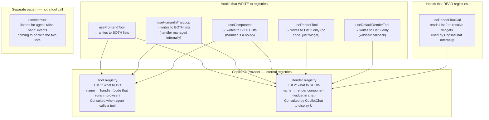
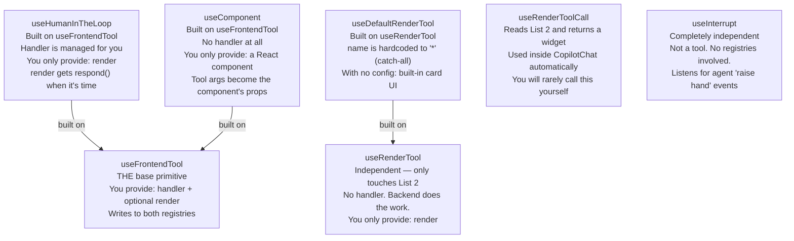
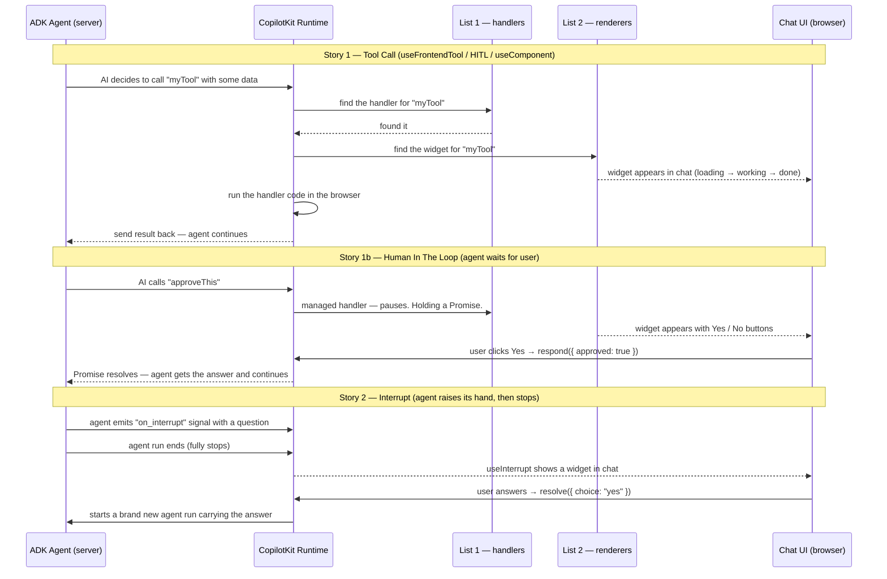
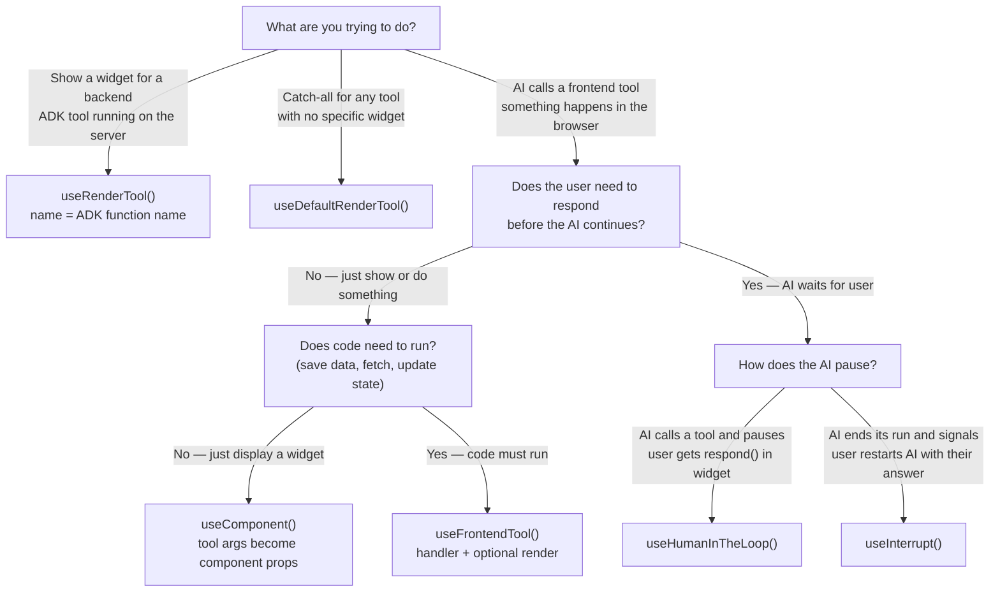

# Tool Hooks — System Anatomy

The 7 hooks split across "Frontend Tools" and "Tool Rendering" in the CopilotKit v2 nav
are **one system**. The nav split is organizational, not architectural. Read them as a chapter.

---

## 0. Plain English First — What This System Actually Does

### ⚠️ Read this first — the one thing that confuses everyone

There is **ONE shared state object**. It has two names because the backend is Python and
the frontend is JavaScript:

| Side | Language | Variable name in the code |
|------|----------|---------------------------|
| Backend (server) | Python | `tool_context.state` |
| Frontend (browser) | JavaScript | `agent.state` |

**Same object. Same data. Two names.** AG-UI is the plumbing that keeps them in sync over
the network. When Python writes `tool_context.state["recipes"] = [...]`, within milliseconds
JavaScript sees `agent.state.recipes` equal to that same value.

Every time this doc says "the shared state" or "the notepad," that is what it means —
one object that both sides can read and write, known by two different variable names.

---

Before any code, here is the idea in everyday language.

**The AI agent lives on the server. Your UI lives in the browser. They need to talk to each other.**

There are two ways the agent talks to the browser:

> **Way 1 — State updates** (covered in F2): The agent continuously writes data to a shared
> notepad. The browser watches the notepad and re-renders whenever something changes.
> This is `useAgent` + `agent.state`. Like a live scoreboard.

**In Recipe Scout — here is exactly where Way 1 lives in your code:**

| What | File | Line(s) | The actual code |
|---|---|---|---|
| Backend writes to the notepad | `agent/src/recipe_scout/tools/search.py` | 32, 48–49 | `tool_context.state["status"] = "searching"` then `tool_context.state["recipes"] = recipes` |
| The notepad's shape (what fields exist) | `agent/src/recipe_scout/contracts.py` | 100–113 | The `AgentState` class — this defines every field the notepad can hold |
| Frontend plugs in to watch the notepad | `frontend/app/page.tsx` | 114 | `const { agent } = useAgent({ agentId: "recipe_scout" });` — this is the hook call. One line. After this, `agent` is live. |
| Frontend reads the notepad | `frontend/app/page.tsx` | 115 | `const agentState = agent.state as AgentState \| null;` — `agent.state` is just a plain object you read like any variable |
| Frontend reacts when notepad changes | `frontend/app/page.tsx` | 127–135 | A `useEffect` watching `agentState?.status` and `agentState?.recipes?.length` — this block runs automatically whenever the backend writes a new value |
| Notepad data passed into the UI | `frontend/app/page.tsx` | 380–381 | `recipes={agentState?.recipes ?? []}` and `isSearching={agentState?.status === "searching"}` — the panel just reads values off the object |

> The mental journey of one piece of data: the backend writes `"searching"` into
> `tool_context.state["status"]` → AG-UI streams it to the browser → `agent.state.status`
> becomes `"searching"` → the `useEffect` on line 127 fires → `setPanelOpen(true)` runs →
> `RecipePanel` receives `isSearching={true}` → skeleton cards appear on screen.

---

> **Way 2 — Tool calls** (this chapter): The agent decides to "press a button" on the browser's
> side. Your code decides what happens when that button is pressed, and what the user sees in
> the chat while it's happening.

**In Recipe Scout — Way 2 is not yet implemented.** None of the 7 hooks below exist in
`page.tsx` yet. Way 1 (state) handles everything for F2. The tool hooks are what this
chapter teaches — they come into play for F3 and beyond.

**These 7 hooks are all about setting up those buttons** — which buttons exist, what code runs
when pressed, and what visual widget appears in the chat thread.

---

### Plain English Glossary

These words appear constantly. Know them before reading further.

| Word | What it means in plain English |
|---|---|
| **Hook** | A special function you call inside a React component to "register" some behaviour. Think of it as plugging a cable into a socket — you call the hook once and CopilotKit handles everything from that point. |
| **Tool** | A named action the AI is allowed to trigger on the browser. The AI decides when to use it, based on the description you write. Think of it as a button the AI can press. |
| **Handler** | The code that actually runs when the AI presses that button. Like the wiring behind the button. |
| **Render** | The visual widget that appears inside the chat thread when the tool is called. Totally optional — without it, the tool call is invisible to the user. |
| **Registry** | An internal lookup table. CopilotKit keeps two: one for handlers (what to *do*), one for renderers (what to *show*). Your hooks write entries into these tables at startup. |
| **Promise** | A way to say "I'll give you the answer later." When a handler is async, it returns a Promise — the agent waits for it to resolve before continuing. Like a restaurant pager — you go sit down, it buzzes when your food is ready. |
| **Status** | Which phase a tool call is currently in: still receiving instructions (InProgress), actively working (Executing), or finished (Complete). Like a package tracker. |
| **respond()** | A callback given to your render component during `useHumanInTheLoop`. Calling it is how the user sends their answer back to the agent, which is paused waiting for it. |
| **resolve()** | Same idea but for `useInterrupt`. Calling it restarts the agent with the user's response. |
| **Zod schema** | A way to describe the shape of data (what fields exist, what types they are). Used to tell the AI what information to include when it calls a tool. |
| **deps / dependency array** | A list of values that, when changed, cause the hook to re-register itself. Same concept as React's `useEffect` deps. If you don't capture external state in your handler, pass `[]`. |
| **followUp** | Whether the AI should write a text message in chat *after* a tool's widget renders. Set to `false` when the widget itself is the complete response. |

---

## 1. The Mental Model — Two Registries

Everything flows through two internal lookup tables (registries) inside the CopilotKit provider.

> **Plain English:** At startup, your hooks register entries in two lists. When the agent
> calls a tool, CopilotKit looks up the tool name in List 1 to find what code to run,
> and in List 2 to find what widget to show. If a name isn't in a list, nothing happens
> for that list — no crash, just nothing.



**Key insight:** `useFrontendTool` is the **only primitive that writes to both lists**.
Every other hook is either a convenience wrapper around it, or it only touches the render list.

---

## 2. Wrapper Hierarchy

> **Plain English:** Some hooks are shortcuts built on top of other hooks. You don't need
> to learn all of them from scratch — once you understand `useFrontendTool`, the others
> are just "same thing, but with one less thing to worry about."



**Reading the chart:** Start at `useFrontendTool`. `useHumanInTheLoop` and `useComponent`
are both "useFrontendTool with less to configure." `useDefaultRenderTool` is
"useRenderTool with the name already filled in." `useInterrupt` stands alone.

---

## 3. Two Interaction Patterns

> **Plain English:** There are really only two stories here.
>
> **Story 1 — The AI presses a button:** The AI calls a named tool mid-conversation.
> CopilotKit runs your handler and shows your widget in the chat. The agent may pause
> waiting for the result, or continue immediately depending on the hook.
>
> **Story 2 — The AI raises its hand:** The AI sends a signal saying "I need a human
> decision before I can go further." The AI then stops. A widget appears, the user
> responds, and a brand new agent run starts carrying that response.
>
> The critical difference: Story 1 happens *during* a run. Story 2 happens *after* a run ends.



### Story 1 vs Story 2 — at a glance

| | Story 1 — Tool Call | Story 2 — Interrupt |
|---|---|---|
| **Hooks** | `useFrontendTool`, `useHumanInTheLoop`, `useComponent` | `useInterrupt` |
| **Who triggers it** | AI LLM explicitly calls a named tool | Agent code emits `on_interrupt` event |
| **When widget appears** | Immediately as the tool call streams in | Only after the agent run fully ends |
| **Agent state** | Mid-run (paused for HITL, or continues) | Run is already over |
| **How user responds** | `respond(value)` | `resolve(value)` |
| **What happens after** | Agent resumes the same run | A brand new agent run starts |
| **Multiple per conversation** | Each tool call is separate | Only the last interrupt per run is shown |

---

## 4. Tool Call Status Lifecycle

> **Plain English:** When the AI calls a tool, it doesn't happen instantly. Think of it
> like a package delivery with three tracking states:
>
> - **InProgress** — The AI is still typing out the details of what it wants.
>   Like watching someone compose a message before hitting send. Your widget can show
>   a loading skeleton. Data may be incomplete.
>
> - **Executing** — The AI finished sending the details. Your code is now running
>   (or for HITL: the widget is waiting for the user to respond). Data is complete.
>
> - **Complete** — Your code finished and sent a result back to the AI. The AI
>   now knows what happened and can continue.

```mermaid
stateDiagram-v2
    [*] --> InProgress: AI starts sending tool arguments
    InProgress --> Executing: All arguments received
    Executing --> Complete: handler finishes / user calls respond()

    state InProgress {
        note: Data arriving — may be partial
        note: Show a loading skeleton here
        note: respond is not available yet
    }
    state Executing {
        note: All data received
        note: Handler is running (useFrontendTool)
        note: Waiting for user (useHumanInTheLoop)
        note: respond() is available now (HITL only)
    }
    state Complete {
        note: Handler returned a result
        note: Result is available as a string
        note: AI has received the answer
    }
```

---

## 5. Hook-by-Hook Reference

---

### `useFrontendTool` — the base primitive

> **Plain English:** "I want to give the AI a named button it can press. When it presses
> it, run my code. Optionally, also show a widget in the chat while it's happening."
>
> This is the hook you reach for when the AI needs to trigger something real — saving data,
> fetching something, updating state. The AI calls it like a function call; your `handler`
> is the function body.

```tsx
useFrontendTool({
  name: "myTool",                       // the name the AI uses to call this
  description: "...",                   // the AI reads this to know WHEN to call it
  parameters: z.object({ ... }),        // describes what data the AI must include
  handler: async (args, ctx) => {       // the code that runs when the AI presses the button
    // ctx.signal — fires if the user stops the agent mid-run
    // ctx.agent  — access to the agent instance
    return "string result";             // sent back to the AI as the tool's answer
  },
  render: ({ args, status, result }) => // optional widget shown in chat during this call
    <MyComponent ... />,
  available: "enabled",                 // "disabled" = AI can't call it right now
  followUp: true,                       // false = widget IS the response, no AI text after
}, [deps]);                             // re-register if these values change
```

**What your render component receives at each stage:**

| Field | InProgress | Executing | Complete |
|---|---|---|---|
| `args` | Partial (streaming) | Complete | Complete |
| `status` | `ToolCallStatus.InProgress` | `ToolCallStatus.Executing` | `ToolCallStatus.Complete` |
| `result` | `undefined` | `undefined` | The string your handler returned |

---

### `useHumanInTheLoop` — pause the AI, ask the user

> **Plain English:** "I want the AI to stop and ask the user something before continuing.
> The AI calls a named tool, a widget appears in chat with options, and the AI sits
> waiting until the user responds. Only then does the AI continue."
>
> Same idea as `useFrontendTool`, but CopilotKit manages the waiting internally.
> You don't write a `handler` — you just write the widget. The widget gets a `respond()`
> function injected into it. When the user clicks a button and you call `respond()`,
> the AI wakes up and continues.

```tsx
useHumanInTheLoop({
  name: "confirmAction",
  description: "Ask the user to confirm before proceeding",
  parameters: z.object({ message: z.string() }),
  render: ({ args, status, respond, result }) => {
    if (status === ToolCallStatus.Executing && respond) {
      // AI is paused here. respond() will wake it up.
      return (
        <div>
          <p>{args.message}</p>
          <button onClick={() => respond({ confirmed: true })}>Yes</button>
          <button onClick={() => respond({ confirmed: false })}>No</button>
        </div>
      );
    }
    if (status === ToolCallStatus.Complete) {
      return <div>Response recorded.</div>;  // AI has the answer, continuing
    }
    return null;
  },
}, []);
```

**Key differences from `useFrontendTool`:**
- No `handler` prop — the pause/resume is managed for you
- `respond` only appears in your render during `Executing` — that is when the AI is waiting
- Call `respond()` exactly once — it resolves the internal Promise and wakes the AI

---

### `useComponent` — agent displays a React component in chat

> **Plain English:** "I want the AI to be able to show a visual card or widget in the chat,
> purely as a display. No code runs, nothing happens behind the scenes — the AI just
> passes data and a component renders it. The widget IS the response."
>
> Think of it as the AI having the ability to insert a custom UI element into the chat thread,
> like attaching a formatted card instead of just writing text.

```tsx
const recipeSchema = z.object({
  title: z.string(),
  url: z.string(),
  description: z.string(),
});

useComponent(
  {
    name: "showRecipeCard",
    description: "Display a recipe card in chat",
    parameters: recipeSchema,
    render: RecipeCard,    // your component — receives title, url, description as props
  },
  [],
);
```

**`useComponent` vs `useFrontendTool` — when to use which:**

| | `useComponent` | `useFrontendTool` |
|---|---|---|
| Runs code | No — display only | Yes — handler executes |
| Shows status phases | No | Yes — InProgress / Executing / Complete |
| Suppresses follow-up text | Always | You choose |
| Mental model | AI inserts a widget | AI triggers an action that may also show a widget |

---

### `useRenderTool` — show a widget for a backend tool

> **Plain English:** "The AI is running a tool on the SERVER (in ADK Python). I can't
> intercept it from the browser. But I want to show the user something in the chat
> while it's happening — like a 'Searching…' spinner or a progress indicator."
>
> This hook only touches the render list (List 2). It has no handler, because the tool
> itself runs on the backend. You're just adding a viewing window into what the backend is doing.

```tsx
useRenderTool(
  {
    name: "search_recipes",             // must exactly match the ADK Python function name
    parameters: z.object({ query: z.string() }),
    render: ({ name, parameters, status, result }) => {
      if (status === "inProgress") return <div>Searching…</div>;
      if (status === "executing") return <div>Finding: {parameters.query}</div>;
      return <div>Search complete</div>;
    },
    agentId: "recipe_scout",            // optional: scope to a specific agent
  },
  [],
);

// Wildcard — renders for any backend tool with no named renderer
useRenderTool({ name: "*", render: ({ name, status }) => <div>{name}: {status}</div> }, []);
```

> Note: status strings here are lowercase (`"inProgress"`, `"executing"`, `"complete"`)
> not the `ToolCallStatus` enum — that enum is only for the frontend tool hooks.

---

### `useDefaultRenderTool` — catch-all widget for any tool

> **Plain English:** "Show *something* in chat for every tool the AI calls, even if
> I haven't set up a specific widget for it. Useful during development to see what
> tools the AI is actually using."
>
> Zero-config usage gives you a built-in expandable card. You can also pass a custom
> render to fully control what the catch-all looks like.

```tsx
// Option A — zero config: built-in expandable card for all tool calls
useDefaultRenderTool();

// Option B — custom catch-all widget
useDefaultRenderTool({
  render: ({ name, status, result }) => (
    <div>{name} — {status}</div>
  ),
}, []);
```

---

### `useRenderToolCall` — internal resolver (you rarely need this)

> **Plain English:** This is the internal machinery that CopilotChat uses to look up
> "which widget should I show for this tool call?" You don't call this — `CopilotChat`
> calls it automatically every time an agent message contains a tool call.
>
> The only time you'd use it directly is if you're building a fully custom chat UI
> that replaces `CopilotChat` entirely.

```tsx
const renderToolCall = useRenderToolCall();

// Inside a custom message renderer (not normal usage):
const element = renderToolCall({
  toolCall: { name: "search_recipes", args: '{"query":"pasta"}' },
  toolMessage: undefined,   // pass the result message when tool is complete
});
// Returns: React element | null
```

---

### `useInterrupt` — handle the agent raising its hand

> **Plain English:** "I want the AI to be able to stop mid-conversation and say
> 'I need a human to decide something before I can continue.' The AI raises a flag,
> finishes its current run, and then a widget appears for the user. When the user
> responds, a brand new AI run starts — carrying the user's answer as input."
>
> The key difference from `useHumanInTheLoop`: HITL pauses the AI *mid-run* using
> a tool call. `useInterrupt` lets the AI *end its run* and then a new run starts.
> The agent explicitly chooses to stop and signal for help. The user's answer becomes
> the starting point of the next run.

```tsx
useInterrupt({
  render: ({ event, result, resolve }) => (
    <div>
      <p>{event.value.question}</p>   {/* event.value is whatever the agent sent */}
      <button onClick={() => resolve({ answer: "yes" })}>Yes</button>
      <button onClick={() => resolve({ answer: "no" })}>No</button>
    </div>
  ),
  handler: async ({ event }) => {       // optional: preprocess the event before rendering
    return { label: event.value.question.toUpperCase() };  // becomes result in render
  },
  enabled: (event) => true,            // optional: filter which interrupts this hook handles
  renderInChat: true,                  // false = return element yourself for custom placement
});
```

**On the backend (ADK Python), the agent raises the interrupt like this:**
```python
# Agent signals it needs human input, then stops
tool_context.actions.skip_summarization = True
await tool_context.emit_custom_event("on_interrupt", {
    "question": "Which recipe do you prefer?",
    "options": ["Pasta", "Pizza"],
})
```

---

## 6. Decision Tree — Which Hook to Use

> **Plain English version of the decision:**
>
> - Seeing what a *backend* tool is doing → `useRenderTool`
> - Catch everything with a generic widget → `useDefaultRenderTool`
> - AI displays something in chat, no side effects → `useComponent`
> - AI triggers something that runs code → `useFrontendTool`
> - AI needs to ask the user and wait for an answer → `useHumanInTheLoop`
> - AI needs to stop entirely and restart with user's answer → `useInterrupt`



---

## 7. Import Cheatsheet

```tsx
import {
  // Frontend tools — agent-callable, write to both registries
  useFrontendTool,       // base: handler + optional render
  useHumanInTheLoop,     // pause AI, wait for respond()
  useInterrupt,          // agent ends run, raises hand, user resolves

  // Tool rendering — write to render registry only
  useComponent,          // display-only: tool args → component props
  useRenderTool,         // backend tool visualization
  useDefaultRenderTool,  // catch-all wildcard renderer
  useRenderToolCall,     // internal resolver — rarely used directly

  // Status enum for render props (frontend tool hooks only)
  ToolCallStatus,        // .InProgress | .Executing | .Complete
} from "@copilotkit/react-core/v2";

import { z } from "zod";   // required for all parameter schemas
```

---

## 8. What Recipe Scout Uses vs What's Available

```
ChatSection (page.tsx)
│
├── useAgent()                                    ✓ F2 — state streaming (agent.state → RecipePanel)
│
NOT YET WIRED — could add any of these:
│
├── useRenderTool({ name: "search_recipes" })     shows a "Searching..." widget in chat
├── useRenderTool({ name: "fetch_recipe_detail" }) shows "Loading recipe..." in chat
├── useDefaultRenderTool()                        dev tool: see ALL tool calls in chat thread
│
F3 candidates — the AI asks for a recipe selection:
├── useHumanInTheLoop({ name: "selectRecipe" })   AI pauses, user picks a recipe in chat, AI continues
└── useInterrupt()                                 AI ends run, raises hand, user picks, new run starts
```

> **Where we are now:** Card selection uses `agent.addMessage + agent.runAgent` — no
> pause/resume cycle. The user's click injects a plain user message and starts a new
> agent run. This works fine today. HITL or Interrupt would add a more structured
> pause-and-respond flow if needed in F3.
